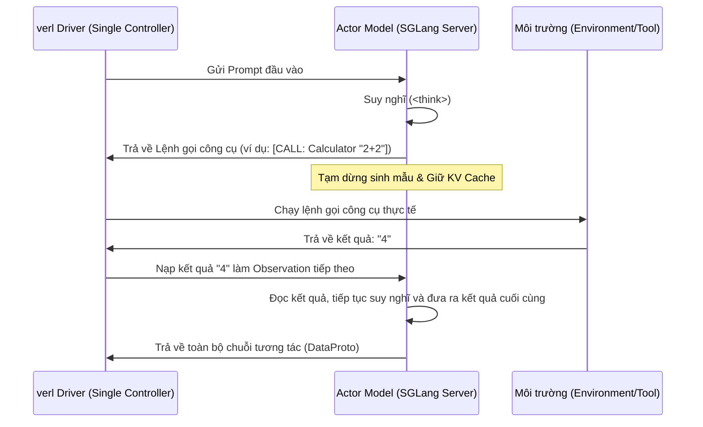

# Case Study 3: Agentic RL - Huấn luyện mô hình gọi công cụ đa lượt

Một mô hình Agent thông minh không chỉ trả lời trong một lượt (Single-turn). Nó phải có khả năng suy nghĩ, phát sinh lệnh gọi công cụ (Tool Calling), tạm dừng để nhận kết quả từ môi trường, rồi tiếp tục suy nghĩ hoặc gọi công cụ khác cho tới khi giải xong bài toán.

Trong Case Study này, chúng ta sẽ khảo sát cách `verl` tích hợp cùng **SGLang** để huấn luyện các Agent lý luận đa lượt thông qua ví dụ thực tế tại `examples/sglang_multiturn`.

---

## 1. Luồng thực thi đa lượt bất đồng bộ (Multi-turn Rollout Loop)

Sự phối hợp giữa `verl` (huấn luyện) và `SGLang` (suy luận gọi công cụ) diễn ra theo chu trình khép kín:



---

## 2. Kỹ thuật che mặt nạ Token trong Huấn luyện đa lượt (Loss Masking)

Đây là thách thức lập trình lớn nhất trong Agentic RL: **Mô hình Actor chỉ được phép học từ các token do chính nó sinh ra (chuỗi suy nghĩ và lệnh gọi công cụ). Nó không được phép học từ các token do môi trường trả về (Observations).**

Nếu không che mặt nạ (masking), mô hình sẽ cố gắng dự đoán xem môi trường sẽ trả về kết quả gì tiếp theo trong pha lan truyền ngược (backward pass). Điều này làm hỏng hoàn toàn khả năng mô hình hóa ngôn ngữ của Actor (vì Actor không thể học cách làm thế nào để trở thành một trình dịch hay một chiếc máy tính bỏ túi).

### Giải pháp Masking trong mã nguồn:
Trong quá trình đóng gói dữ liệu đa lượt, `verl` gán nhãn trạng thái cho từng token trong chuỗi.
* Token của Prompt gốc và kết quả của công cụ (Observation) được đánh dấu là `mask=0` (Không tính vào hàm loss cross-entropy).
* Token của suy nghĩ và token lệnh gọi công cụ được đánh dấu là `mask=1` (Tính loss huấn luyện bình thường).

```
Chuỗi token đa lượt:
[ Prompt (mask=0) ] [ Think 1 (mask=1) ] [ CALL: Tool (mask=1) ] [ Result (mask=0) ] [ Think 2 (mask=1) ]
```

---

## 3. Tận dụng tối ưu KV Cache đa lượt của SGLang

Việc sinh mẫu qua nhiều lượt tương tác nếu thực hiện theo cách thông thường sẽ bắt buộc mô hình phải quét lại (re-compute) toàn bộ chuỗi lịch sử từ đầu ở mỗi lượt mới.

SGLang giải quyết bài toán này thông qua tính năng **Dynamic KV Cache Sharing**:
* Khi Actor tạm dừng để đợi công cụ phản hồi, SGLang đóng băng toàn bộ trạng thái KV Cache của các lượt trước đó trên VRAM.
* Khi có kết quả từ công cụ nạp vào, SGLang chỉ cần tính toán KV Cache cho phần token Observation mới và ghép nối trực tiếp vào bộ đệm có sẵn.
* Việc này giúp tăng tốc độ Rollout đa lượt lên gấp 5-10 lần, giảm thiểu tối đa điện năng hao phí của GPU.

---

## 4. Kịch bản chạy huấn luyện (`run_qwen2.5-3b_gsm8k_multiturn.sh`)

Mã nguồn khởi chạy mẫu huấn luyện Agentic RL trong `verl`:

```bash
# run_qwen2.5-3b_gsm8k_multiturn.sh
python3 -m verl.trainer.main_ppo \
    actor_rollout_ref.rollout.type=sglang \
    actor_rollout_ref.rollout.port=30000 \
    actor_rollout_ref.rollout.n=1 \
    actor_rollout_ref.rollout.space_max_token_len=4096 \
    data.train_files=examples/sglang_multiturn/gsm8k_toolcall_shaping/train.jsonl \
    algorithm.adv_estimator=grpo \
    trainer.total_epochs=2
```

### Điểm nhấn cấu hình:
* `actor_rollout_ref.rollout.type=sglang`: Sử dụng SGLang làm nhân suy luận thay thế cho vLLM mặc định để hỗ trợ tốt cấu trúc gọi công cụ đa lượt.
* `actor_rollout_ref.rollout.space_max_token_len=4096`: Nới rộng không gian token lên 4K để chứa toàn bộ lịch sử tương tác nhiều vòng giữa Agent và công cụ.

## 💡 Kết luận

Huấn luyện Agentic RL là bước phát triển tiếp theo của LLM:
* Kết hợp giữa `verl` và `SGLang` tạo ra giải pháp tối ưu nhất hiện nay để huấn luyện Agent hiệu năng cao.
* Kỹ thuật Loss Masking chính xác đảm bảo mô hình chỉ tối ưu hóa các quyết định tư duy và gọi công cụ của chính nó.
