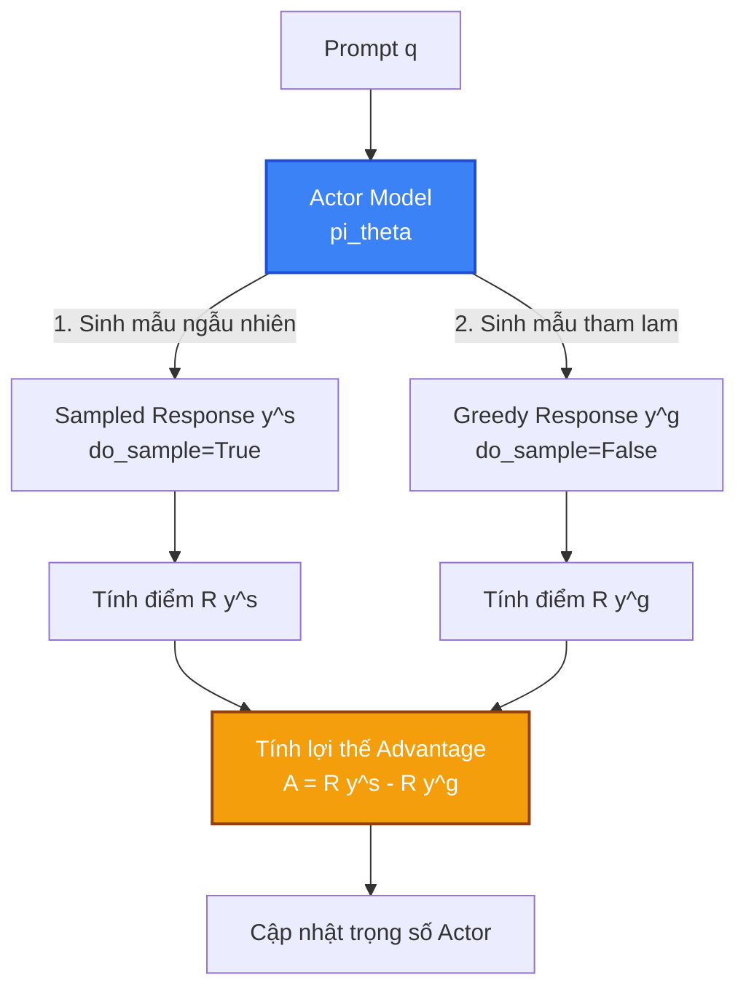

# Case Study 4: Thuật toán ReMax - Giải pháp thay thế PPO tối ưu VRAM

Mặc dù PPO hoạt động hiệu quả, việc duy trì mô hình **Critic** để dự đoán giá trị cơ sở (baseline) gây tiêu hao năng lượng và bộ nhớ GPU rất lớn (Critic thường có kích thước tương đương Actor). Để huấn luyện RLHF hiệu quả hơn trên các cấu hình phần cứng giới hạn, `verl` tích hợp thuật toán **ReMax** (dựa trên bài báo *"ReMax: A Simple, Effective, and Efficient Alternative to PPO"*).

Case Study này phân tích nguyên lý toán học và chi tiết hiện thực của ReMax trong `verl`.

---

## 1. Nguyên lý toán học của ReMax: Loại bỏ mạng Critic

Ý tưởng cốt lõi của ReMax là thay thế mô hình Critic bằng **phần thưởng của một câu trả lời mẫu sinh ra theo phương thức tham lam (Greedy Baseline)**.



### Cách thức hoạt động cho mỗi prompt $q$:
1. Sinh câu trả lời ngẫu nhiên $y^s$ (sampling) từ chính sách Actor hiện tại $\pi_\theta$. Tính điểm thưởng tương ứng: $R(y^s)$.
2. Sinh câu trả lời tham lam $y^g$ (greedy - lấy các token có xác suất cao nhất) từ chính sách Actor hiện tại $\pi_\theta$. Tính điểm thưởng tương ứng: $R(y^g)$.
3. Tính toán giá trị Lợi thế (Advantage) trực tiếp bằng cách lấy hiệu số hai phần thưởng:
   $$\hat{A} = R(y^s) - R(y^g)$$
   * Nếu câu trả lời ngẫu nhiên $y^s$ tốt hơn câu trả lời mặc định tham lam $y^g$, Actor sẽ nhận điểm thưởng dương và ngược lại.

Cơ chế này hoàn toàn loại bỏ nhu cầu huấn luyện mạng Critic phụ trợ, giúp thuật toán trở nên đơn giản và loại bỏ được sự mất ổn định khi tối ưu hóa mạng Critic.

---

## 2. Hiện thực ReMax trong vòng lặp `RayPPOTrainer.fit()`

Như chúng ta đã lần vết mã nguồn trong file `verl/trainer/ppo/ray_trainer.py` (dòng 1315-1342), luồng xử lý ReMax được tích hợp trực tiếp:

```python
# Trích đoạn logic chạy ReMax trong ray_trainer.py
if self.config.algorithm.adv_estimator == AdvantageEstimator.REMAX:
    with marked_timer("gen_max", timing_raw, color="purple"):
        # 1. Tạo bản sao của batch đầu vào, đặt tham số do_sample = False để chạy Greedy
        gen_baseline_batch = deepcopy(gen_batch)
        gen_baseline_batch.meta_info["do_sample"] = False
        
        # 2. Phát sinh mẫu tham lam từ vLLM
        gen_baseline_output = self.async_rollout_manager.generate_sequences(gen_baseline_batch)
        self.checkpoint_manager.sleep_replicas()
        
        # 3. Tính điểm thưởng cho mẫu tham lam
        batch = batch.union(gen_baseline_output)
        if self.use_rm and "rm_scores" not in batch.batch.keys():
            batch_reward = self._compute_reward_colocate(batch)
            batch = batch.union(batch_reward)
        
        # 4. Trích xuất làm baseline reward
        reward_baseline_tensor = batch.batch["rm_scores"].sum(dim=-1)
        batch.batch["reward_baselines"] = reward_baseline_tensor
```

Sau đó, trong hàm `compute_advantage`, lợi thế sẽ được tính đơn giản bằng cách lấy hiệu của điểm thưởng mẫu ngẫu nhiên trừ đi `reward_baselines`.

---

## 3. Lợi ích vượt trội về bộ nhớ và hiệu năng

1. **Tiết kiệm VRAM cực lớn**: 
   Loại bỏ hoàn toàn mô hình Critic giúp giải phóng 25-30% dung lượng VRAM GPU. Khoảng trống này có thể được nhường cho vLLM để tăng gấp đôi kích thước Batch Size lúc giải mã, hoặc dùng để chạy các mô hình Actor lớn hơn trên cùng cấu hình phần cứng.
2. **Tốc độ huấn luyện nhanh hơn**: 
   Chúng ta không cần chạy lan truyền thuận/ngược (forward/backward) và cập nhật gradient cho mạng Critic, giúp giảm tải khoảng 30% số lượng phép tính FLOPs trong pha huấn luyện.
3. **Hội tụ ổn định**: 
   ReMax không phụ thuộc vào chất lượng dự đoán của Critic (vốn rất dễ bị lệch hoặc hội tụ chậm trong giai đoạn đầu huấn luyện), giúp chu kỳ cập nhật của Actor diễn ra ổn định hơn.

## 💡 Kết luận

ReMax là một sự thay thế xuất sắc cho PPO trong môi trường tài nguyên hạn chế:
* Giúp các doanh nghiệp vừa và nhỏ có thể huấn luyện căn chỉnh (alignment) LLM hiệu quả mà không cần đầu tư hệ thống GPU khổng lồ.
* Bản chất phi trạng thái của baseline tham lam (tính toán động trực tiếp từ Actor) giúp giảm độ phức tạp thiết kế hệ thống phân tán xuống mức tối thiểu.
