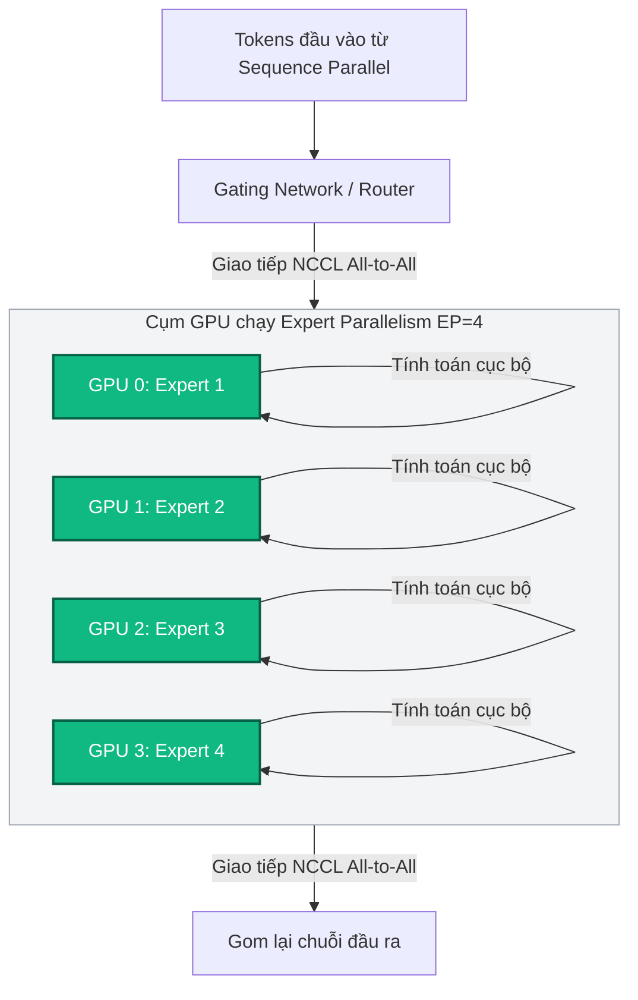

# Case Study 5: Mở rộng mô hình MoE 671B với Expert Parallelism

Để huấn luyện các mô hình lý luận siêu lớn như **DeepSeek-R1** hoặc **DeepSeek-V3** (tổng số 671B tham số, trong đó 37B tham số kích hoạt cho từng token), việc sử dụng song song dữ liệu hoặc song song tensor truyền thống sẽ gặp thất bại do nghẽn băng thông và tràn bộ nhớ. 

`verl` giải quyết bài toán quy mô lớn này thông qua sự kết hợp giữa **Expert Parallelism (EP)** và **DeepSpeed Ulysses (Sequence Parallelism)**.

---

## 1. Cơ chế hoạt động của Expert Parallelism (EP)

Trong mô hình MoE (Mixture of Experts), lớp FFN (Feed-Forward Network) thông thường được thay thế bằng nhiều "Chuyên gia" (Experts) song song độc lập. Lập trình viên sử dụng Expert Parallelism để phân tán các chuyên gia này lên các GPU khác nhau trong cụm.

Ví dụ: Nếu mô hình có 8 chuyên gia ($E=8$) và ta chạy trên hệ thống có Expert Parallelism size bằng 8 ($EP=8$), mỗi GPU sẽ chỉ lưu trữ và xử lý duy nhất 1 chuyên gia trong bộ nhớ VRAM của mình.



### Luồng truyền thông điệp All-to-All:
1. Mô hình sử dụng một mạng cổng (Gating/Router Network) để dự đoán xem mỗi token nên được gửi đến chuyên gia nào xử lý.
2. Hệ thống thực hiện giao tiếp mạng **NCCL All-to-All** để định tuyến (route) và phân phát các token từ GPU hiện tại đến đúng GPU đang chứa chuyên gia tương ứng.
3. Các GPU tính toán song song cục bộ trên các token được phân phát.
4. Chạy thêm một lệnh **NCCL All-to-All** ngược lại để gom các token đã tính toán xong về vị trí ban đầu của chuỗi văn bản.

---

## 2. Kết hợp DeepSpeed Ulysses (Sequence Parallelism)

Để tối ưu hóa chiều dài ngữ cảnh (Context Length) lớn khi huấn luyện MoE, `verl` tích hợp song song chuỗi bằng **DeepSpeed Ulysses**:
* Chuỗi token đầu vào được cắt nhỏ theo chiều dọc (Sequence Length) và phân phối đều cho các GPU.
* Khi thực hiện cơ chế Attention, hệ thống chạy một lệnh All-to-All để gom các phần Attention Head tương ứng về cùng một GPU để tính toán cục bộ, sau đó chạy All-to-All để trả về.
* Sự kết hợp này mang lại khả năng song song hóa 3 chiều tối ưu (EP + SP + DP/FSDP), giúp huấn luyện ngữ cảnh siêu dài trên cụm lớn.

---

## 3. Cấu hình tối ưu Expert Parallelism trong verl

Chúng ta cấu hình tham số Expert Parallelism kết hợp Megatron-LM backend trong tệp YAML của `verl`:

```yaml
# Cấu hình huấn luyện MoE lớn trong verl
actor_rollout_ref:
  actor:
    strategy: megatron
    moe:
      ep_size: 8              # Thiết lập kích thước Expert Parallelism = 8
      moe_type: megatron      # Sử dụng nhân MoE của Megatron
      use_sequence_parallel: True # Bật song song chuỗi Sequence Parallelism
      aux_loss_coeff: 0.001   # Trọng số hàm loss phạt mất cân bằng expert
```

### Giải quyết bài toán Lệch tải Chuyên gia (Expert Imbalance):
Nếu một chuyên gia cụ thể (ví dụ: Chuyên gia dịch thuật hoặc lập trình) nhận quá nhiều token từ Router so với các chuyên gia khác, GPU chứa chuyên gia đó sẽ bị quá tải (straggler), kéo chậm tốc độ của toàn cụm. 

`verl` giải quyết bằng cách áp dụng **Auxiliary Loss (Hàm loss phụ trợ)**:
* Phạt mô hình nếu Router định tuyến token lệch quá nhiều vào một nhóm chuyên gia.
* Khuyến khích Router phân phối token đều cho các chuyên gia để đạt độ cân bằng tải tính toán hoàn hảo trên các GPU.

## 💡 Kết luận

Việc làm chủ Expert Parallelism và Sequence Parallelism là điều bắt buộc khi tiến hành huấn luyện các mô hình Frontier LLM lớn:
* `verl` cung cấp tích hợp sẵn có với Megatron-LM giúp các kỹ sư hệ thống dễ dàng khai thác song song MoE.
* Sự tối ưu hóa giao tiếp All-to-All CUDA-level giúp giảm tối đa độ trễ truyền dữ liệu chéo GPU, nâng cao hiệu suất FLOPs của toàn cụm.
