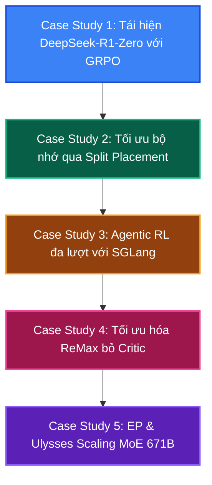

# Lộ trình Case Studies Thực chiến với verl

Chào mừng bạn đến với chương **Case Studies Thực chiến**. Sau khi đã nắm vững lý thuyết cốt lõi của thư viện `verl` (từ Bài 0 đến Bài 8), phần này sẽ đưa bạn vào các kịch bản thực tế khi huấn luyện và mở rộng quy mô hệ thống học tăng cường.

Dưới đây là giáo trình gồm 5 Case Studies thực tế được biên soạn trực tiếp từ các ví dụ sản xuất và tích hợp mã nguồn trong `verl`:

---

---

## Danh sách các bài giảng thực chiến

1. **[Case Study 1: Tái hiện DeepSeek-R1-Zero với GRPO (TinyZero)](case_1_tiny_zero_grpo)**
   * Huấn luyện mô hình lý luận (Reasoning Model) từ mô hình Qwen-2.5-3B.
   * Cách viết hàm thưởng kiểm định quy tắc và định dạng thẻ `<think>`.
2. **[Case Study 2: Lập lịch tối ưu phần cứng với Split Placement](case_2_split_placement)**
   * Giải quyết tràn bộ nhớ GPU (OOM) bằng cách tách biệt cụm GPU chạy Actor/Rollout và Critic/Reward.
3. **[Case Study 3: Agentic RL - Huấn luyện mô hình gọi công cụ đa lượt](case_3_agentic_multiturn)**
   * Tích hợp SGLang Server để huấn luyện mô hình tương tác môi trường qua nhiều lượt.
4. **[Case Study 4: Thuật toán ReMax - Giải pháp thay thế PPO tối ưu VRAM](case_4_remax_optimization)**
   * Cách huấn luyện RLHF không cần Critic Network để tiết kiệm 30-40% bộ nhớ.
5. **[Case Study 5: Mở rộng mô hình MoE 671B với Expert Parallelism và DeepSpeed Ulysses](case_5_moe_scaling)**
   * Cấu hình cluster hàng trăm GPU huấn luyện mô hình MoE khổng lồ như DeepSeek-R1.
