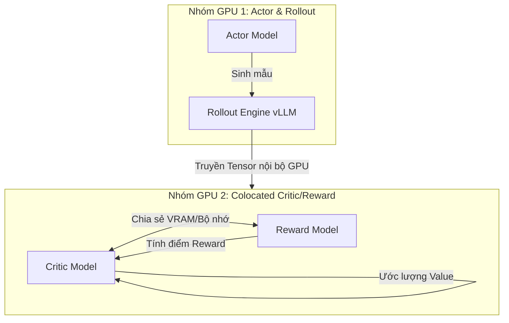

# Bài 1: Huấn luyện PPO với mô hình phần thưởng phân tán và cơ chế Colocated Critic/Reward

## 1. Bài toán thực tế (Use Case)

Trong các bài toán căn chỉnh mô hình ngôn ngữ lớn (LLM Alignment) theo phản hồi của con người, chúng ta thường sử dụng giải thuật PPO (Proximal Policy Optimization). Lúc này, thay vì sử dụng các luật cứng để chấm điểm phản hồi, hệ thống cần căn chỉnh dựa trên một **Mô hình phần thưởng thần kinh (Neural Reward Model - RM)**. RM này là một mô hình phân loại (Sequence Classification Transformer) được huấn luyện từ tập dữ liệu so sánh (preference dataset) của con người để dự đoán phản hồi nào được ưa thích hơn.

Ví dụ thực nghiệm này mô phỏng quá trình huấn luyện PPO cho mô hình Qwen2-7B (Actor/Policy) sử dụng một mô hình đánh giá Qwen2-7B-RM (Reward Model).

---

## 2. Nút thắt hệ thống: Sự lãng phí tài nguyên của Critic và Reward Model

Trong vòng lặp huấn luyện PPO tiêu chuẩn, hệ thống cần chạy song song 4 mô hình:
1. **Actor** ($\pi_\theta$): Sinh chuỗi văn bản (Rollout) và tối ưu hóa trọng số.
2. **Reference Policy** ($\pi_{ref}$): Cố định trọng số để tính toán án phạt KL.
3. **Critic** ($V_\phi$): Ước lượng giá trị trạng thái để làm baseline tính toán GAE.
4. **Reward Model** ($R_\psi$): Chấm điểm phản hồi sau khi kết thúc chuỗi sinh.

Nếu triển khai mỗi mô hình trên một nhóm Worker độc lập trên Ray (mỗi nhóm chiếm dụng GPU riêng biệt), chúng ta sẽ gặp hai vấn đề nghiêm trọng:
* **Overhead bộ nhớ GPU cực lớn**: Mô hình Critic và Reward Model đều là các mô hình lớn (thường có cùng kích thước với Actor, ví dụ 7B tham số). Việc tải hai mô hình này lên các GPU riêng biệt sẽ chiếm dụng phần lớn VRAM khả dụng của cụm máy chủ.
* **Độ trễ truyền thông cao**: Kết quả sinh mẫu (Rollout) từ Actor GPU phải được sao chép thông qua bộ nhớ chia sẻ Ray (Plasma Store) hoặc mạng truyền thông để đưa vào GPU của Reward Model chấm điểm, sau đó điểm số lại được truyền về GPU của Critic để tính Advantage. Việc truyền tải tensor lớn liên tục qua mạng tạo ra nút thắt cổ chai giao tiếp đáng kể.

---

## 3. Giải pháp hệ thống: Cơ chế Colocated Critic/Reward

Để giải quyết vấn đề trên, `verl` giới thiệu kỹ thuật **Colocated Workers (Worker đồng địa chỉ)** thông qua mô hình lập trình của `3D-HybridEngine`. 

Bản chất của cơ chế Colocation là **Critic** và **Reward Model** sẽ chia sẻ chung tài nguyên tính toán (GPU) và bộ nhớ thông qua việc chạy trên cùng một nhóm vật lý của các GPU Worker.



Vì **Reward Model** chỉ hoạt động ở pha tính điểm thưởng (Forward Pass trên dữ liệu đã sinh ra) và **Critic** hoạt động chủ yếu ở pha học (Forward/Backward Pass để cập nhật giá trị), hai mô hình này không cần tính toán đồng thời trên GPU. `verl` cho phép chúng hoán đổi bộ nhớ (qua kỹ thuật CPU offloading hoặc giải phóng bộ đệm kích hoạt động) hoặc đơn giản là chia sẻ chung một tensor song song hóa (Tensor Parallelism) trên cùng GPU để loại bỏ hoàn toàn việc giao tiếp qua mạng Ray.

---

## 4. Phân tích Kịch bản Huấn luyện thực tế

Kịch bản huấn luyện PPO kết hợp Colocated Reward Model được định nghĩa chi tiết trong file ví dụ:
[run_qwen2-7b_rm_reward_loop_colocate.sh](file:///Users/admin/TuanDung/repos/verl/examples/ppo_trainer/run_qwen2-7b_rm_reward_loop_colocate.sh)

Dưới đây là các tham số cấu hình cốt lõi cần lưu ý trong file này:

### A. Cấu hình mô hình phần thưởng phân tán
```bash
    reward.model.path=Qwen/Qwen2-7B-Reward \
    reward.tensor_model_parallel_size=2 \
    reward.fsdp_config.param_offload=True \
```
* `reward.model.path`: Trỏ tới checkpoint của mô hình đánh giá Sequence Classification Transformer (ví dụ Qwen2-7B-Reward).
* `reward.tensor_model_parallel_size=2`: Phân mảnh mô hình RM theo cơ chế song song tensor (Tensor Parallelism) trên 2 GPU để xử lý các chuỗi văn bản dài mà không bị OOM.
* `reward.fsdp_config.param_offload=True`: Cho phép đẩy (offload) tham số của Reward Model từ GPU về CPU RAM khi mô hình không ở trạng thái tính toán.

### B. Thiết lập cơ chế Colocation cho Critic và Reward Model
Trong file cấu hình YAML mặc định của PPO (`ppo_default.yaml`), cơ chế colocate được kích hoạt qua việc xếp chung tài nguyên Ray:
```yaml
# Cấu hình colocated worker group
colocate_critic_reward: True
```
Khi tham số này được thiết lập là `True`, `verl` sẽ khởi tạo một nhóm `RayWorkerGroup` duy nhất chịu trách nhiệm cho cả hai vai trò Critic và Reward. Dữ liệu đầu ra của Rollout (các token được sinh ra) chỉ cần truyền đến nhóm này một lần duy nhất, giúp giảm 50% lưu lượng mạng truyền thông.

---

## 5. Liên hệ mã nguồn verl

Cơ chế tạo và quản lý các nhóm Worker đồng địa chỉ được quản lý tại:
* [verl/trainer/ppo/ray_trainer.py](file:///Users/admin/TuanDung/repos/verl/verl/trainer/ppo/ray_trainer.py):
  Trong phương thức `init_workers`, mã nguồn kiểm tra xem biến cấu hình `colocate_critic_reward` có bằng `True` hay không để quyết định gom nhóm tài nguyên:
  ```python
  if self.config.colocate_critic_reward:
      # Khởi tạo một RayWorkerGroup chung cho cả Critic và Reward Model
      self.critic_reward_group = RayWorkerGroup(
          resource_pool=self.critic_reward_resource_pool,
          worker_class=ColocatedCriticRewardWorker
      )
  ```
* Lớp `ColocatedCriticRewardWorker` đóng vai trò là một proxy gọi luân phiên hàm `compute_values` của Critic và `compute_reward` của Reward Model ngay trên cùng một luồng tiến trình GPU, triệt tiêu hoàn toàn chi phí sao chép tensor qua mạng chia sẻ.
