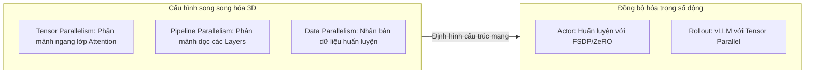

# Bài 2: Huấn luyện GRPO quy mô siêu lớn với Megatron-LM và Hybrid Engine

## 1. Bài toán thực tế (Use Case)

Khi huấn luyện các mô hình suy luận lớn (Large Reasoning Models) như DeepSeek-R1 hoặc các biến thể của nó trên các bài toán logic phức tạp (GSM8K, MATH, LeetCode), chúng ta muốn mô hình tự học cách suy nghĩ lập luận sâu (Reasoning) thông qua việc tự sửa sai trong thẻ `<think>...</think>`. 

Với các tác vụ này, việc sử dụng một mô hình đánh giá (Neural Reward Model) rất dễ dẫn đến hiện tượng **Reward Hacking** (mô hình tìm ra lỗ hổng của RM để viết ra những câu trả lời vô nghĩa nhưng vẫn được điểm cao). Do đó, giải pháp tối ưu là sử dụng **Hàm thưởng dựa trên quy tắc (Rule-based Verifier)** kết hợp thuật toán **GRPO** (Group Relative Policy Optimization) để tối ưu hóa trực tiếp mà không cần mạng Critic.

---

## 2. Hàm thưởng dựa trên quy tắc (Rule-based Verifier)

Bộ xác thực quy tắc là một hàm Python thuần túy (deterministic function) thực hiện hai nhiệm vụ kiểm tra chính:
1. **Kiểm tra định dạng (Format Verification)**: Đảm bảo câu trả lời chứa đúng các thẻ định dạng yêu cầu, ví dụ: bắt đầu bằng thẻ `<think>` và kết thúc suy nghĩ bằng `</think>`, đồng thời kết quả cuối cùng phải nằm trong khối `\boxed{}`.
2. **Kiểm tra độ chính xác (Accuracy Verification)**: Trích xuất chuỗi đáp án số học hoặc biểu thức nằm trong `\boxed{}` bằng biểu thức chính quy (Regex) và so khớp trực tiếp với Ground Truth.

### Công thức toán học của hàm thưởng lai (Format + Accuracy)

Điểm thưởng của phản hồi $y$ cho câu hỏi $q$ với đáp án đúng $a^*$ được định nghĩa như sau:

$$R(q, y) = R_{\text{format}}(y) + R_{\text{accuracy}}(y, a^*)$$

Trong đó:
* $R_{\text{format}}(y) \in \{0.0, 0.133\}$ chấm điểm thưởng nhỏ nếu mô hình tuân thủ cấu trúc định dạng suy nghĩ.
* $R_{\text{accuracy}}(y, a^*) \in \{0.0, 1.0\}$ chấm điểm tuyệt đối nếu đáp án trích xuất trùng khớp với $a^*$.

Cơ chế này hoàn toàn loại bỏ hiện tượng Reward Hacking vì đáp án toán học là tuyệt đối chính xác hoặc sai, đồng thời giúp loại bỏ hoàn toàn mạng Critic và mạng Reward Model khỏi bộ nhớ GPU, tiết kiệm khoảng **50% đến 60%** tài nguyên bộ nhớ VRAM.

---

## 3. Song song hóa 3D Megatron-LM trên Hybrid Engine

Khi kích thước mô hình vượt quá giới hạn của một GPU đơn lẻ (ví dụ các mô hình từ 32B đến 671B tham số), cơ chế phân mảnh FSDP tiêu chuẩn của PyTorch bắt đầu bộc lộ hạn chế về hiệu năng truyền thông All-Gather. Để giải quyết, `verl` tích hợp hệ thống song song hóa **Megatron-LM** kết hợp với **3D-HybridEngine** để phân chia mô hình.

Các cơ chế song song hóa bao gồm:
* **Tensor Parallelism (TP)**: Phân mảnh trực tiếp các ma trận trọng số (Weights Matrix) của các lớp Linear Attention (QKV và Projection) trên các GPU trong cùng một node.
* **Pipeline Parallelism (PP)**: Chia các lớp Transformer (Layers) thành các phân đoạn xếp chồng chồng lên nhau theo chiều dọc của các GPU khác nhau.
* **Data Parallelism (DP)**: Nhân bản mô hình trên các node để xử lý các batch dữ liệu huấn luyện độc lập.



---

## 4. Phân tích Kịch bản Huấn luyện Megatron GRPO

Kịch bản huấn luyện GRPO quy mô siêu lớn với Megatron-LM được thể hiện qua tệp ví dụ:
[run_deepseek671b_math_megatron_80gb.sh](file:///Users/admin/TuanDung/repos/verl/examples/grpo_trainer/run_deepseek671b_math_megatron_80gb.sh)

Dưới đây là các tham số cấu hình hệ thống song song cực kỳ quan trọng trong file chạy này:

```bash
    actor_rollout_ref.model.path=deepseek-ai/DeepSeek-V3 \
    actor_rollout_ref.actor.megatron_config.tensor_model_parallel_size=16 \
    actor_rollout_ref.actor.megatron_config.pipeline_model_parallel_size=4 \
    actor_rollout_ref.rollout.tensor_model_parallel_size=8 \
```

* `tensor_model_parallel_size=16`: Song song hóa Tensor của Actor trên 16 GPU.
* `pipeline_model_parallel_size=4`: Song song hóa đường ống dẫn (Pipeline) của Actor trên 4 phân đoạn GPU.
* `rollout.tensor_model_parallel_size=8`: vLLM Rollout Engine chạy song song Tensor trên 8 GPU để tối ưu hóa tốc độ sinh mẫu bất đồng bộ.
* `reward.custom_reward_function.path`: Đường dẫn trỏ tới mã Python chứa hàm kiểm tra đáp án toán học dạng cứng, ví dụ: `verl/utils/reward_score/math.py`.

---

## 5. Liên hệ mã nguồn verl

Hệ thống quản lý resharding giữa Megatron-LM và vLLM được hiện thực hóa tại:
* [verl/workers/sharding_manager/megatron_vllm.py](file:///Users/admin/TuanDung/repos/verl/verl/workers/sharding_manager/megatron_vllm.py):
  Tệp này định nghĩa lớp `MegatronVLLMShardingManager` chịu trách nhiệm chuyển đổi và phân bố lại các phân mảnh trọng số từ cấu trúc song song Megatron (TP/PP) sang cấu trúc song song Tensor của vLLM để thực hiện pha Rollout, sau đó gom và trả lại gradient cho pha học (Actor Update) của Megatron.
  
  Quá trình này được thực hiện qua các phép biến đổi tensor bằng thư viện truyền thông phân tán NCCL (All-Gather và All-to-All).
