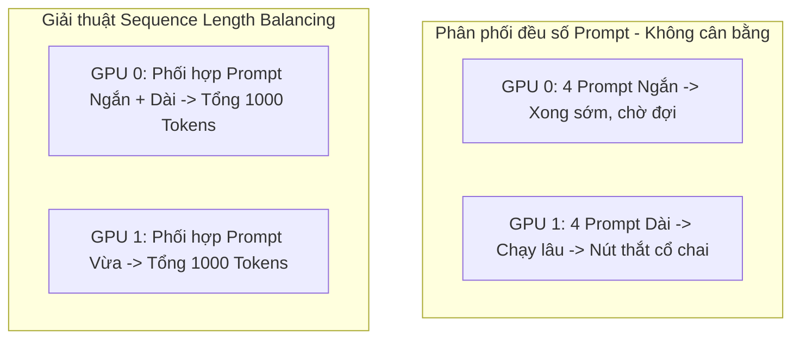

# Bài 4: Tối ưu hóa hiệu năng thu thập mẫu: Sequence Length Balancing và Fused Kernels

## 1. Nút thắt hiệu năng trong RLHF (The Rollout Bottleneck)

Trong huấn luyện RLHF cho LLM, pha sinh mẫu (Rollout/Generation Phase) chiếm tới **60% đến 80%** tổng thời gian của một vòng lặp huấn luyện. Nguyên nhân là do pha sinh mẫu yêu cầu chạy mô hình ở chế độ tự hồi quy (Autoregressive Generation) để tạo ra từng token một (tương tác liên tục với bộ nhớ I/O GPU), trong khi pha học (Actor Update Phase) chạy ở chế độ song song hóa tối đa qua các toán tử ma trận (Parallel Forward/Backward Pass).

Vì vậy, mọi tối ưu hóa ở pha sinh mẫu đều mang lại hiệu quả tăng tốc độ huấn luyện tổng thể cực kỳ rõ rệt.

---

## 2. Hiện tượng Straggler do mất cân bằng độ dài chuỗi (Sequence Length Variance)

Trong một batch câu hỏi (prompts) huấn luyện, các câu trả lời do mô hình sinh ra có thể có độ dài cực kỳ chênh lệch. Ví dụ:
* Prompt 1 chỉ sinh ra phản hồi dài 50 tokens.
* Prompt 2 sinh ra lập luận dài tới 1024 tokens (đặc biệt trong các mô hình suy luận).

Nếu chúng ta phân phối dữ liệu theo cách chia đều số lượng prompt cho mỗi GPU (ví dụ GPU 0 nhận 4 prompts ngắn, GPU 1 nhận 4 prompts dài):
* GPU 0 sẽ hoàn thành sinh chuỗi chỉ sau vài giây và rơi vào trạng thái nhàn rỗi (idle).
* GPU 1 tiếp tục tính toán sinh chuỗi trong thời gian dài.
* Theo cơ chế đồng bộ hóa phân tán, GPU 0 bắt buộc phải đứng chờ GPU 1 hoàn thành thì mới có thể bắt đầu pha tối ưu hóa (Actor Update). Hiện tượng này gọi là **Straggler Effect (Hiện tượng thắt nút cổ chai do thiết bị chạy chậm)**.



---

## 3. Giải pháp: Sequence Length Balancing và Fused Kernels

Để triệt tiêu hiện tượng Straggler, `verl` triển khai hai kỹ thuật tối ưu hóa hiệu năng hệ thống:

### A. Sequence Length Balancing (Cân bằng độ dài chuỗi)
Trước khi đưa các prompt vào các GPU chạy sinh mẫu (vLLM hoặc SGLang), `verl` sử dụng một thuật toán phân chia động:
1. Dự đoán hoặc thống kê độ dài của các chuỗi sinh ra ở các step trước đó.
2. Gom nhóm các prompt và phân phối chúng sao cho **tổng số token dự kiến sinh ra trên mỗi GPU là tương đương nhau**, chứ không phải số lượng prompt tương đương nhau.
3. Nhờ đó, tất cả GPU Rollout sẽ kết thúc pha sinh mẫu gần như cùng một lúc, tối đa hóa hiệu suất sử dụng GPU (GPU Utilization).

### B. Fused Kernels (Nhân tính toán tích hợp)
Pha sinh mẫu đòi hỏi đọc ghi liên tục vào bộ nhớ GPU (high memory bandwidth pressure). Để giảm thiểu việc nạp/xuất tensor liên tục từ bộ nhớ toàn cục (HBM) vào bộ nhớ đệm (SRAM) của GPU, `verl` kích hoạt các Fused Kernels:
* **FlashAttention / PagedAttention**: Giảm độ phức tạp bộ nhớ của ma trận Attention từ $O(N^2)$ xuống $O(N)$ và quản lý KV-Cache phân mảnh hiệu quả.
* **Fused RoPE (Rotary Position Embedding)**: Gom nhóm các phép quay tọa độ góc và tính toán trực tiếp trong một nhân CUDA duy nhất.
* **Fused RMSNorm**: Tích hợp phép chuẩn hóa vector trước khi đưa vào các lớp MLP.

---

## 4. Phân tích Kịch bản Huấn luyện thực tế

Kịch bản tối ưu hóa hiệu năng thu thập mẫu được thiết lập trong tệp ví dụ:
[run_qwen2-7b_rm_seq_balance_fused_kernels.sh](file:///Users/admin/TuanDung/repos/verl/examples/ppo_trainer/run_qwen2-7b_rm_seq_balance_fused_kernels.sh)

Chúng ta hãy phân tích các cấu hình then chốt giúp tối ưu hóa hiệu năng trong file chạy này:

```bash
    actor_rollout_ref.rollout.name=vllm \
    actor_rollout_ref.rollout.gpu_memory_utilization=0.4 \
    actor_rollout_ref.model.use_remove_padding=True \
    actor_rollout_ref.model.enable_gradient_checkpointing=True \
    actor_rollout_ref.rollout.tensor_model_parallel_size=2 \
```

* `actor_rollout_ref.rollout.name=vllm`: Sử dụng vLLM Engine để sinh mẫu tốc độ cao thông qua PagedAttention và các Fused Kernels.
* `actor_rollout_ref.model.use_remove_padding=True`: Loại bỏ hoàn toàn các token đệm (Padding Tokens) khi đưa tensor vào Actor. Việc loại bỏ padding giúp tiết kiệm tài nguyên tính toán vì GPU không cần thực hiện nhân ma trận trên các token vô nghĩa.
* `actor_rollout_ref.rollout.gpu_memory_utilization=0.4`: Chỉ định tỷ lệ bộ nhớ GPU dành riêng cho vLLM KV-Cache để tối ưu hóa kích thước batch sinh mẫu mà không đè lên phần VRAM của pha tối ưu hóa (Actor/Critic).

---

## 5. Liên hệ mã nguồn verl

Giải thuật điều phối và phân bổ cân bằng được quản lý tại:
* [verl/trainer/ppo/ray_trainer.py](file:///Users/admin/TuanDung/repos/verl/verl/trainer/ppo/ray_trainer.py):
  Trong pha thu thập Rollout, Driver sẽ gọi module `SequenceBalanceManager` để tính toán ma trận phân phối prompt:
  ```python
  # Phân chia prompt dựa trên độ dài lịch sử
  balanced_prompts = self.sequence_balance_manager.redistribute(prompts)
  ```
  Nhờ lớp quản lý này, dữ liệu đầu vào được đóng gói (packed) và gửi đến các vLLM workers một cách cân bằng nhất trước khi gọi hàm thực thi sinh mẫu.
