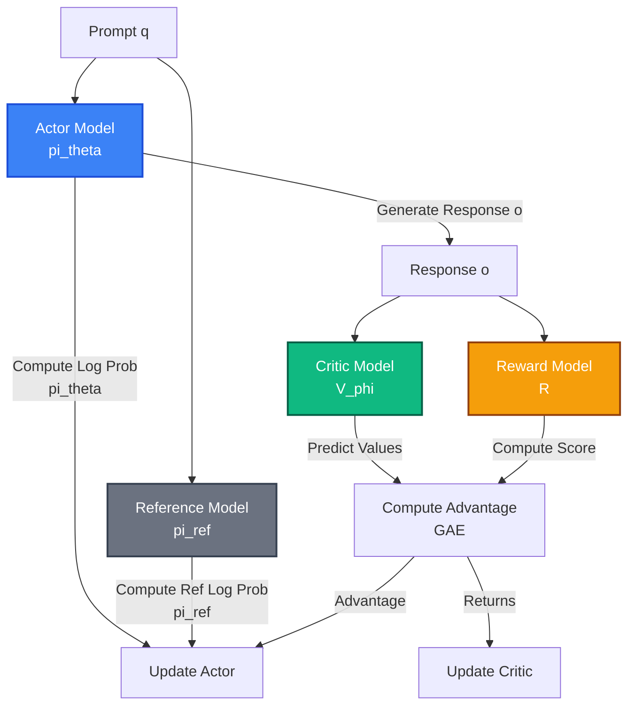
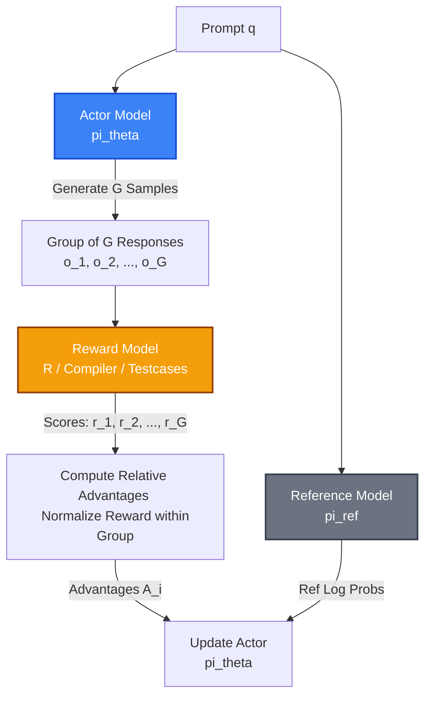

# Bài 0: Nền tảng Alignment & Thuật toán PPO vs GRPO

Để hiểu được lý do tại sao thư viện **verl** ra đời và cách nó tối ưu hóa hệ thống, trước tiên chúng ta phải nắm vững nền tảng lý thuyết về **Alignment** (Căn chỉnh mô hình ngôn ngữ) và hai thuật toán học tăng cường (RL) phổ biến nhất hiện nay: **PPO (Proximal Policy Optimization)** và **GRPO (Group Relative Policy Optimization)**.

---

## 1. Tại sao LLM cần Alignment?

Các mô hình ngôn ngữ lớn (LLM) sau giai đoạn Pre-training (huấn luyện tiền đề) chỉ đơn thuần là các máy dự đoán token tiếp theo cực mạnh. Chúng có thể tạo ra thông tin sai lệch (hallucination), nội dung độc hại hoặc không tuân thủ chỉ dẫn của con người.

Để giải quyết vấn đề này, mô hình cần trải qua quá trình **Alignment** thông qua ba giai đoạn phổ biến:

1. **SFT (Supervised Fine-Tuning)**: Huấn luyện mô hình bắt chước các cặp câu hỏi-trả lời mẫu do con người viết sẵn. SFT đơn giản nhưng bị giới hạn bởi chất lượng và số lượng dữ liệu mẫu (mô hình không thể vượt qua trình độ của người viết mẫu).
2. **DPO (Direct Preference Optimization)**: Tối ưu hóa trực tiếp từ dữ liệu ưu tiên (tốt hơn/tệ hơn) mà không cần mạng RL phức tạp. DPO dễ chạy nhưng có thể gặp vấn đề mất ổn định khi mô hình dịch chuyển xa khỏi phân phối dữ liệu ban đầu.
3. **RLHF / RLAIF (Reinforcement Learning from Human/AI Feedback)**: Huấn luyện mô hình tự khám phá (exploration) các câu trả lời khác nhau, sau đó nhận điểm thưởng (reward) từ con người hoặc mô hình AI khác để cập nhật trọng số. RLHF đặc biệt mạnh mẽ đối với các tác vụ tư duy và lập luận toán học phức tạp nhờ khả năng tự sửa lỗi (self-correction) trong chu kỳ huấn luyện.

---

## 2. Thuật toán PPO (Proximal Policy Optimization) trong RLHF

PPO là thuật toán học tăng cường dựa trên Policy Gradient, được OpenAI sử dụng để huấn luyện ChatGPT.

### 2.1. Cấu trúc 4 mô hình của PPO trong RLHF
Một hệ thống PPO tiêu chuẩn yêu cầu tải đồng thời **4 mô hình lớn** lên GPU:

1. **Actor ($\pi_\theta$)**: Mô hình đích cần huấn luyện. Nó nhận câu hỏi (prompt) và sinh ra câu trả lời (response).
2. **Reference ($\pi_{ref}$)**: Mô hình đóng băng (frozen) trọng số tại thời điểm ban đầu. Nó dùng để tính độ lệch KL Divergence nhằm ngăn Actor thay đổi quá nhiều so với mô hình gốc, tránh hiện tượng suy sụp chính sách (policy collapse).
3. **Critic ($V_\phi$)**: Mô hình ước lượng giá trị (Value Network). Nó dự đoán tổng điểm thưởng tương lai cho mỗi trạng thái/token. Mạng này giúp giảm phương sai khi tính Policy Gradient.
4. **Reward ($R$)**: Mô hình tính điểm thưởng (Reward Network). Nó đánh giá xem câu trả lời của Actor tốt hay tệ.

### 2.2. Công thức toán học cốt lõi
Mục tiêu của PPO là tối ưu hóa hàm Surrogate Loss bị cắt (clipped surrogate objective) để tránh việc cập nhật quá lớn:

$$L^{CLIP}(\theta) = \hat{\mathbb{E}}_t \left[ \min\left(r_t(\theta)\hat{A}_t, \text{clip}(r_t(\theta), 1-\epsilon, 1+\epsilon)\hat{A}_t\right) \right]$$

Trong đó:
* Tỷ lệ xác suất (Probability Ratio): $r_t(\theta) = \frac{\pi_\theta(a_t | s_t)}{\pi_{\theta_{old}}(a_t | s_t)}$
* $\hat{A}_t$ là giá trị Lợi thế (Advantage) được tính thông qua GAE (Generalized Advantage Estimation) từ các giá trị dự đoán của Critic ($V_\phi$) và Reward ($R$).
* KL Penalty được cộng trực tiếp vào phần thưởng ở cấp độ token để điều phối Actor không đi quá xa khỏi Reference:
  $$R_{KL}(s_t, a_t) = R(s_t, a_t) - \beta \log \frac{\pi_\theta(a_t | s_t)}{\pi_{ref}(a_t | s_t)}$$

---

## 3. Thuật toán GRPO (Group Relative Policy Optimization)

Được giới thiệu bởi DeepSeek (trong loạt mô hình DeepSeekMath, DeepSeek-R1-Zero), **GRPO** là một bước đột phá giúp giảm đáng kể chi phí phần cứng và cải thiện hiệu năng huấn luyện các mô hình lý luận (Reasoning models).

### 3.1. Tại sao GRPO loại bỏ Critic?
Trong PPO, mô hình Critic ($V_\phi$) có dung lượng bộ nhớ lớn tương đương với Actor. Việc tải đồng thời cả 4 mô hình lớn khiến GPU dễ bị tràn bộ nhớ (OOM) hoặc giới hạn kích thước batch (Batch size).

GRPO loại bỏ hoàn toàn mô hình Critic bằng cách **so sánh tương đối kết quả giữa các nhóm câu trả lời**. Thay vì dùng Critic để dự đoán giá trị cơ sở (baseline), GRPO sinh ra một nhóm gồm $G$ câu trả lời cho cùng một câu hỏi và lấy điểm trung bình của nhóm này làm baseline.

### 3.2. Quy trình và toán học của GRPO
Với mỗi prompt $q$, quy trình diễn ra như sau:

1. Sinh ra nhóm $G$ câu trả lời: $\{o_1, o_2, ..., o_G\}$ từ chính sách hiện tại $\pi_\theta$.
2. Đánh giá tất cả câu trả lời bằng hàm thưởng hoặc mô hình thưởng $R$ để thu về tập điểm: $\{r_1, r_2, ..., r_G\}$.
3. Tính toán Lợi thế tương đối (Relative Advantage) $A_i$ cho từng câu trả lời $o_i$ bằng cách chuẩn hóa điểm số trong nhóm:
   $$A_i = \frac{r_i - \text{mean}(R)}{\text{std}(R)}$$
   Trong đó $R = \{r_1, r_2, ..., r_G\}$. Nhờ cơ chế này, nếu một câu trả lời tốt hơn mức trung bình của nhóm, nó sẽ có lợi thế dương; ngược lại sẽ nhận lợi thế âm.
4. Hàm mục tiêu tối ưu hóa của GRPO:
   $$J_{GRPO}(\theta) = \frac{1}{G} \sum_{i=1}^G \sum_{t=1}^T \left[ \min\left( \frac{\pi_\theta(o_{i,t} | q, o_{i,<t})}{\pi_{\theta_{old}}(o_{i,t} | q, o_{i,<t})} A_i, \text{clip}\left(\frac{\pi_\theta(o_{i,t} | q, o_{i,<t})}{\pi_{\theta_{old}}(o_{i,t} | q, o_{i,<t})}, 1-\epsilon, 1+\epsilon\right) A_i \right) - \beta D_{KL}(\pi_\theta || \pi_{ref}) \right]$$

Trong đó:
* $D_{KL}(\pi_\theta || \pi_{ref}) = \frac{\pi_{ref}(o_{i,t} | q, o_{i,<t})}{\pi_\theta(o_{i,t} | q, o_{i,<t})} - \log \frac{\pi_{ref}(o_{i,t} | q, o_{i,<t})}{\pi_\theta(o_{i,t} | q, o_{i,<t})} - 1$ (phiên bản xấp xỉ KL penalty được đề xuất bởi Schulman).

---

## 💡 So sánh tổng quan PPO vs GRPO

| Tiêu chí | PPO (Standard) | GRPO (DeepSeek Style) |
| :--- | :--- | :--- |
| **Yêu cầu Mô hình** | Actor, Reference, Critic, Reward (4 mô hình) | Actor, Reference, Reward (3 mô hình, không cần Critic) |
| **Hao phí bộ nhớ VRAM** | Rất cao (Critic chiếm dung lượng lớn) | Thấp hơn khoảng 30-40% nhờ bỏ Critic |
| **Ước lượng baseline** | Sử dụng mạng neural Critic ($V_\phi$) | Ước lượng trực tiếp bằng trung bình của nhóm mẫu |
| **Số lượng sinh mẫu** | Thường là $N=1$ hoặc $N=2$ trên mỗi prompt | Lớn hơn nhiều ($G=4$ đến $G=16$) để tính thống kê nhóm |
| **Khả năng song song** | Phức tạp do luồng Critic và Actor lệch nhau | Cực kỳ thích hợp cho các engine phân tán như `verl` |

Sự tinh giản và cấu trúc phi trạng thái của GRPO giúp các kỹ sư hệ thống dễ dàng thiết kế luồng dữ liệu song song hóa. Trong các bài học tiếp theo, chúng ta sẽ xem cách `verl` hiện thực hóa và phân phối các vai trò (roles) này trên cụm GPU.
