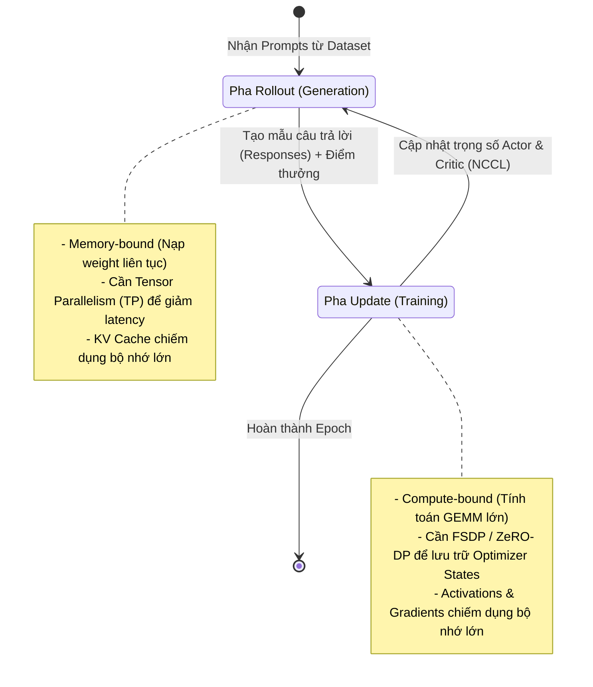

# Bài 1: Thách thức Kỹ thuật Hệ thống trong Distributed RLHF

Việc huấn luyện Học tăng cường phản hồi từ con người (RLHF) trên các mô hình ngôn ngữ lớn (LLM) không chỉ phức tạp về mặt thuật toán mà còn là một **cơn ác mộng về mặt kỹ thuật hệ thống (Systems Engineering)**. 

Bài viết này phân tích sâu sắc các rào cản vật lý và phần mềm khiến các framework huấn luyện Deep Learning truyền thống (như PyTorch DDP, Megatron-LM hay DeepSpeed đơn lẻ) gặp bế tắc khi xử lý RLHF, và tại sao chúng ta cần một giải pháp như `verl`.

---

## 1. Chu kỳ Rollout-Training: Sự bất tương xứng về tính chất tính toán

Khác với huấn luyện tiền đề (Pre-training) hay tinh chỉnh giám sát (SFT) vốn có luồng tính toán đồng nhất, huấn luyện RLHF (PPO/GRPO) liên tục chuyển đổi giữa hai pha có tính chất đối nghịch nhau: **Rollout (Generation)** và **Update (Training)**.



### So sánh chi tiết hai pha tính toán:

| Đặc tính | Pha Rollout (Sinh mẫu) | Pha Update (Huấn luyện) |
| :--- | :--- | :--- |
| **Giới hạn hiệu năng** | **Memory-bandwidth bound** (bị nghẽn bởi tốc độ đọc trọng số từ HBM vào SRAM của GPU cho từng token) | **Compute-bound** (tận dụng tối đa lõi Tensor để tính nhân ma trận GEMM trên toàn bộ chuỗi) |
| **Thành phần ngốn VRAM** | **KV Cache** của các request đang xử lý | **Optimizer States** (Adam), Gradients, và Activations trong quá trình backward |
| **Chiến lược song song hóa tối ưu** | **Tensor Parallelism (TP)** để phân mảnh mô hình, giảm độ trễ sinh token (vLLM, SGLang) | **ZeRO-DP / FSDP** hoặc **Pipeline Parallelism (PP)** để tối ưu hóa bộ nhớ tham số và tăng throughput |
| **Hạ tầng tối ưu nhất** | Các Inference Engine hiệu năng cao (vLLM, SGLang, TGI) | Các Training Engine phân tán (Megatron-LM, PyTorch FSDP) |

Sự bất tương xứng này dẫn đến việc nếu sử dụng chung một chiến lược song song hóa hoặc cùng một engine cho cả hai pha, hiệu năng tổng thể sẽ bị kéo sụt nghiêm trọng. Ví dụ: Nếu dùng FSDP để sinh mẫu, tốc độ giải mã cực kỳ chậm do thiếu PagedAttention và không có Continuous Batching; ngược lại, nếu dùng TP cho huấn luyện, chi phí giao tiếp NCCL All-Reduce sẽ làm chậm tiến trình tối ưu.

---

## 2. Bức tường bộ nhớ VRAM (The Multi-Model VRAM Jam)

Để thực hiện PPO tiêu chuẩn, ta cần tải đồng thời 4 mô hình: Actor, Reference, Critic và Reward. Hãy làm một phép toán thực tế để thấy sự khủng khiếp về nhu cầu VRAM.

### Giả định: Sử dụng mô hình Llama-3-8B (dung lượng ~16GB ở định dạng FP16/BF16)

1. **Bộ nhớ lưu trữ trọng số (Weights):**
   * Actor (BF16): 16 GB
   * Reference (BF16): 16 GB
   * Critic (BF16): 16 GB
   * Reward (BF16): 16 GB
   * **Tổng cộng trọng số:** $16 \times 4 = 64\text{ GB}$ (Vượt quá dung lượng của một GPU A100 40GB và chiếm 80% chiếc A100 80GB).

2. **Trạng thái huấn luyện (Training States) của Actor & Critic:**
   * Gradients (BF16) cho Actor và Critic: $16 \times 2 = 32\text{ GB}$.
   * Optimizer States (Adam lưu trữ bằng FP32 - yêu cầu 8 bytes cho mỗi tham số):
     * Actor: $8 \times 8\text{B} = 64\text{ GB}$.
     * Critic: $8 \times 8\text{B} = 64\text{ GB}$.
   * **Tổng cộng trạng thái huấn luyện:** $32 + 64 + 64 = 160\text{ GB}$.

3. **Bộ nhớ động (Activations & KV Cache):**
   * Bộ đệm KV Cache phục vụ sinh mẫu hàng ngàn token cùng lúc: $\sim 10\text{ - }20\text{ GB}$.
   * Activations lưu trữ trong quá trình lan truyền ngược (backward pass): $\sim 20\text{ - }40\text{ GB}$.

> [!CAUTION]
> **Tổng nhu cầu bộ nhớ thực tế:** Vượt quá **250 GB** VRAM! 
> Một GPU A100 hoặc H100 80GB đơn lẻ hoàn toàn không thể chứa nổi cấu hình này. Chúng ta bắt buộc phải phân phối 4 mô hình này trên một cụm GPU (Cluster) nhiều nút thông qua các kỹ thuật sharding phức tạp.

---

## 3. Rào cản phần mềm: Sự ràng buộc chặt chẽ (Coupling)

Trước khi `verl` xuất hiện, các thư viện RLHF đời đầu (như DeepSpeed-Chat hay các nhánh Megatron-LM tùy biến) lựa chọn giải pháp **Colocated Unified Controller**. Tức là, họ gộp chung cả 4 mô hình vào chạy trên cùng một tập GPU và cùng một cấu hình song song.

```
Thiết kế cũ (Coupled):
[ GPU 0..7 ] ---> Chạy đồng thời Actor (FSDP) + Critic (FSDP) + Ref (FSDP) + Reward (FSDP)
                  (Không thể dùng vLLM TP cho riêng Actor lúc Generate)
```

### Nhược điểm lớn của thiết kế cũ:
1. **Thiếu linh hoạt**: Rất khó để thay đổi cấu hình song song (ví dụ: chuyển Actor sang TP2 để sinh mẫu nhanh, còn Critic chạy FSDP để tiết kiệm bộ nhớ).
2. **Khó tái sử dụng mã nguồn**: Code huấn luyện bị bó chặt với một backend cụ thể. Nếu bạn viết code PPO chạy trên DeepSpeed, bạn không thể tái sử dụng nó nếu muốn chuyển sang Megatron-LM để huấn luyện mô hình MoE khổng lồ.
3. **Hiệu năng kém**: Không thể tích hợp các công nghệ suy luận tối tân như PagedAttention của vLLM vì vLLM yêu cầu phân chia tài nguyên và cơ chế luồng hoàn toàn khác với các engine huấn luyện.

Để giải quyết triệt để các thách thức trên, ByteDance đã đề xuất kiến trúc **HybridFlow** - tách biệt hoàn toàn phần điều khiển và tính toán, làm nền tảng cho thư viện `verl`. Chúng ta sẽ phân tích mô hình lập trình này trong Bài 2.
