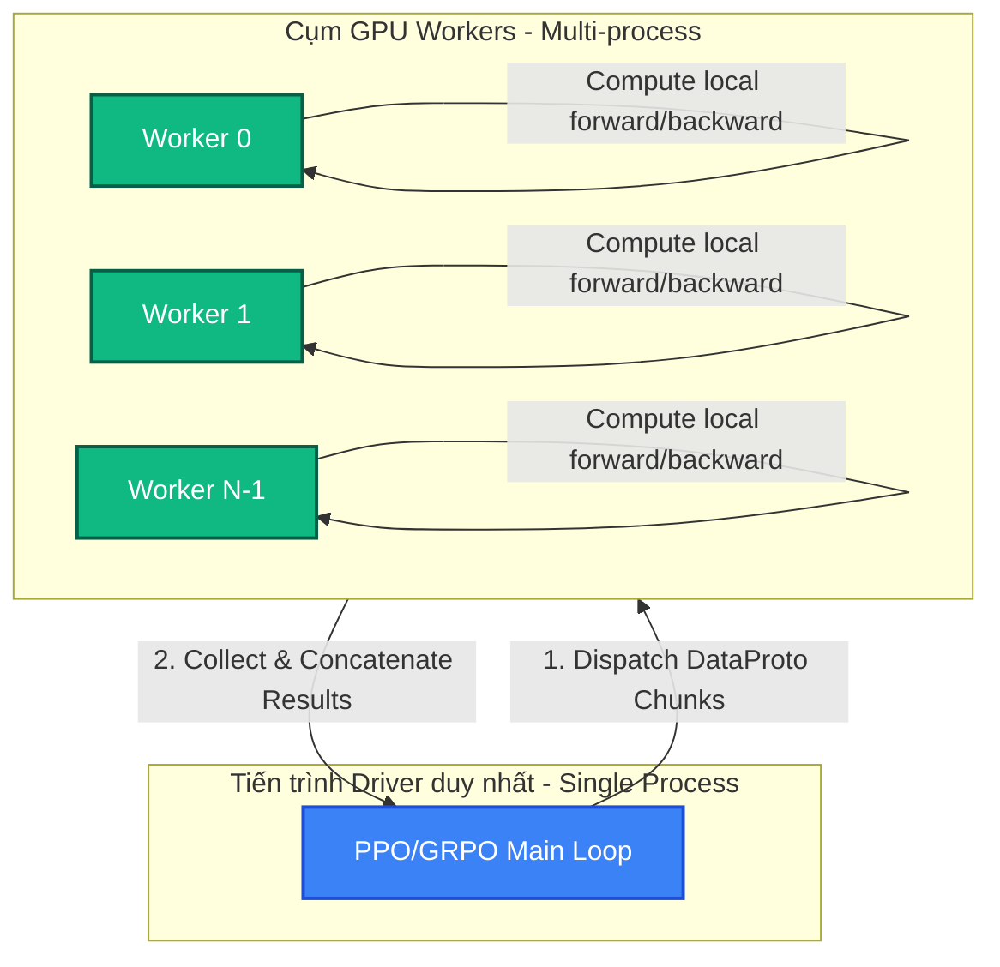

# Bài 2: Mô hình Lập trình HybridFlow & Cơ chế Single-Controller

Để giải quyết bài toán phức tạp và nghẽn bộ nhớ trong huấn luyện RLHF (đã thảo luận ở Bài 1), `verl` áp dụng thiết kế đột phá dựa trên bài báo **HybridFlow**. Thiết kế này đề xuất mô hình lập trình **Single-Controller (Bộ điều khiển đơn)** giúp đơn giản hóa tối đa việc lập trình hệ thống phân tán.

---

## 1. Triết lý thiết kế: Phân tách Luồng điều khiển và Luồng tính toán

Trong các framework truyền thống như PyTorch DDP, lập trình viên phải viết code theo dạng SPMD (Single Program, Multiple Data) – tức là một đoạn code chạy song song trên nhiều tiến trình GPU khác nhau. Điều này khiến việc viết các thuật toán RL phức tạp (như PPO/GRPO có nhiều nhánh rẽ, điều kiện dừng, đánh giá) trở nên cực kỳ khó debug.

**verl đề xuất giải pháp tách biệt hoàn toàn:**

1. **Luồng điều khiển (Control Flow)**: Chạy trên một tiến trình duy nhất (Driver/Controller). Driver này chạy trên CPU hoặc GPU đầu tiên, đóng vai trò điều phối chính và định nghĩa toàn bộ chu kỳ lặp PPO/GRPO dưới dạng mã Python tuần tự.
2. **Luồng tính toán (Computation Flow)**: Chạy song song trên cụm nhiều GPU Workers thông qua thư viện **Ray**. Khi Driver cần thực hiện các tính toán nặng (như lan truyền thuận/ngược, tối ưu hóa mạng), nó sẽ gửi yêu cầu tính toán bất đồng bộ (RPC) tới các nhóm Worker.



---

## 2. Các thành phần chính trong `verl.single_controller`

Để ẩn đi sự phức tạp của việc giao tiếp đa tiến trình (multi-agent RPC) thông qua Ray, `verl` cung cấp 3 thực thể trừu tượng:

* **`WorkerGroup`**: Quản lý một nhóm các Ray Actor (tiến trình remote chạy trên các GPU). Driver sẽ tương tác trực tiếp với `WorkerGroup` thay vì từng Worker đơn lẻ.
* **`ResourcePool`**: Liên kết các tài nguyên phần cứng (số lượng GPU, số lượng node) với các nhóm Worker tương ứng.
* **`ClassWithArgs`**: Cho phép trì hoãn việc khởi tạo class trên các Worker từ xa kèm theo các tham số cấu hình định sẵn.

---

## 3. Cơ chế đăng ký `@register` và phân phối dữ liệu (Dispatching)

Để biến một class thông thường thành một dịch vụ phân tán chạy trên GPU, ta chỉ cần kế thừa lớp `Worker` và sử dụng decorator `@register` để định nghĩa cách phân phối dữ liệu đầu vào/đầu ra.

### Ví dụ về định nghĩa Worker:

```python
from verl import Worker, register
from verl.single_controller.base.decorator import Dispatch, Execute
from verl.protocol import DataProto

class ActorRolloutRefWorker(Worker):
    def __init__(self, config):
        self.config = config
        self.actor_model = None

    def init_model(self):
        # Khởi tạo mô hình Actor thực tế
        self.actor_model = build_fsdp_model(...)

    @register(dispatch_mode=Dispatch.DP_COMPUTE_PROTO)
    def generate_sequences(self, prompts: DataProto) -> DataProto:
        # Code sinh mẫu thực tế chạy cục bộ trên GPU của worker
        outputs = self.actor_model.generate(prompts.batch['input_ids'])
        return DataProto.from_dict(tensors={'responses': outputs})
```

### Cơ chế hoạt động của `@register(dispatch_mode=Dispatch.DP_COMPUTE_PROTO)`:

Khi Driver thực hiện lệnh:
```python
output = actor_rollout_ref_wg.generate_sequences(prompts)
```

Hệ thống Single-Controller của `verl` sẽ tự động thực hiện 3 bước dưới lớp nền:

1. **Dispatch (Phân phối)**: Trích xuất dữ liệu `prompts` (là một `DataProto` lớn). Cắt nhỏ (chunk) theo chiều Batch Size thành $N$ phần bằng nhau ($N$ là số lượng GPU Workers trong Group). Gửi mỗi phần tới một Worker tương ứng qua RPC của Ray.
2. **Execute (Thực thi)**: Các Worker nhận dữ liệu cục bộ, chạy luồng tính toán song song trên GPU của mình.
3. **Collect (Thu thập)**: Thu thập $N$ kết quả trả về từ các Worker từ xa, tự động ghép (concatenate) chúng lại thành một đối tượng `DataProto` duy nhất và trả về cho Driver.

---

## 4. Giao thức trao đổi dữ liệu: `DataProto`

Trong `verl`, mọi dữ liệu truyền tải giữa Driver và Workers bắt buộc phải tuân theo cấu trúc **`DataProto`** (hiện thực hóa trong file `verl/protocol.py`).

`DataProto` đóng gói 3 thành phần chính:

1. **`batch` (TensorDict)**: Một cấu trúc của PyTorch (`tensordict.TensorDict`) cho phép chứa một từ điển các Tensor có cùng chiều batch dim đầu tiên (Batch Size). Ta có thể thực hiện các phép toán cắt lát (slicing), chuyển thiết bị (`.to(device)`) hay thay đổi kích thước đồng bộ trên tất cả các Tensor bên trong như thể nó là một Tensor duy nhất.
2. **`non_tensor_batch` (dict)**: Chứa các dữ liệu phi tensor dưới dạng numpy object-array (ví dụ: chuỗi prompt gốc bằng String, nhãn ID của request, v.v.). Các phần tử trong này cũng phải có kích thước tương đồng với Batch Size.
3. **`meta_info` (dict)**: Chứa các cấu hình bổ trợ không phụ thuộc vào kích thước Batch (như giá trị nhiệt độ `temperature`, token ID kết thúc `eos_token_id`, bước huấn luyện hiện tại `global_steps`).

### Mã nguồn tuần tự hóa tối ưu của `DataProto`
Để gửi dữ liệu qua mạng Ray nhanh chóng, `DataProto` định nghĩa phương thức `__getstate__` và `__setstate__` tùy biến. Nó hỗ trợ chuyển đổi các Tensor sang định dạng mảng byte tuần tự hóa bằng Numpy hoặc `torch.save` để tận dụng cơ chế chia sẻ bộ nhớ (shared memory IPC) của Ray mà không tốn chi phí sao chép dữ liệu (zero-copy):

```python
def __getstate__(self):
    # Nếu cấu hình serialize bằng numpy, chuyển đổi tensordict sang numpy buffer
    if os.getenv("VERL_DATAPROTO_SERIALIZATION_METHOD") == "numpy":
        batch = serialize_tensordict(self.batch)
        return (batch, self.non_tensor_batch, self.meta_info)
    else:
        # Ngược lại dùng bộ đệm byte của PyTorch
        buffer = io.BytesIO()
        torch.save(self.batch, buffer)
        return (buffer.getvalue(), self.non_tensor_batch, self.meta_info)
```

---

## 💡 Ưu điểm vượt trội của mô hình Lập trình verl

* **Độ linh hoạt cao**: Đoạn mã chạy trên Driver hoàn toàn độc lập với phần cứng bên dưới. Nếu bạn chuyển đổi từ huấn luyện FSDP (Data Parallel) sang Megatron-LM (3D Parallelism), bạn chỉ cần thay đổi Worker Class tương ứng khi khởi tạo WorkerGroup, toàn bộ mã điều phối huấn luyện PPO/GRPO trên Driver giữ nguyên 100%.
* **Dễ debug**: Vì chu trình huấn luyện chính chạy tuần tự trên một tiến trình duy nhất (Driver), lập trình viên có thể đặt các điểm dừng (breakpoint), in ra kích thước của các tensor trung gian (`DataProto.print_size()`), hoặc kiểm định dữ liệu trực quan mà không bị rối loạn bởi hàng trăm tiến trình chạy song song.
