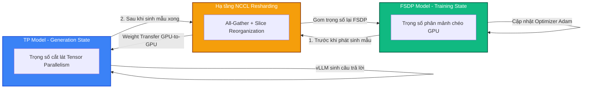

# Bài 3: 3D-HybridEngine & Cơ chế Tự động Resharding Trọng số

Một trong những đóng góp công nghệ quan trọng nhất của thư viện **verl** (được giới thiệu trong bài báo HybridFlow) là **3D-HybridEngine**. Đây là giải pháp xử lý triệt để sự bất tương xứng về chiến lược song song hóa giữa hai pha Rollout (Generation) và Update (Training) mà chúng ta đã đặt vấn đề ở Bài 1.

---

## 1. Bản chất sự lệch pha chiến lược song song (Parallelism Mismatch)

Tại sao chúng ta không thể sử dụng cùng một cấu hình phân mảnh mô hình (sharding) cho cả suy luận và huấn luyện?

1. **Khi Huấn luyện (Training)**: Cần hiệu năng băng thông lớn (high throughput) để nạp dữ liệu huấn luyện nhanh nhất. Chiến lược phổ biến là **FSDP (Fully Sharded Data Parallel)** hoặc **ZeRO-3**. Trong đó, trọng số mô hình, gradients, và trạng thái tối ưu (optimizer states) được băm nhỏ đều trên tất cả các rank GPU. Việc này giúp tiết kiệm tối đa VRAM. Giao tiếp truyền thông (all-gather) chỉ xảy ra khi chạy forward/backward của từng lớp.
2. **Khi Giải mã/Sinh mẫu (Generation - Rollout)**: Cần độ trễ cực thấp (low latency) trên từng bước giải mã tự hồi quy (token-by-token autoregressive decoding). Nếu giữ nguyên cơ chế FSDP, với mỗi token sinh ra, ta phải all-gather toàn bộ trọng số của lớp đó. Điều này tạo ra độ trễ mạng NCCL kinh khủng. Do đó, pha này bắt buộc phải dùng **Tensor Parallelism (TP)** – chia nhỏ trọng số của từng ma trận để tính toán song song mà không cần gom toàn bộ trọng số mô hình.

```
    Cấu hình FSDP (Phục vụ Huấn luyện):
    [ GPU 0: 1/4 Model ]  [ GPU 1: 1/4 Model ]  [ GPU 2: 1/4 Model ]  [ GPU 3: 1/4 Model ]
    
    Cấu hình Tensor Parallelism (Phục vụ Sinh mẫu):
    [ GPU 0: Layer Slice A ]  [ GPU 1: Layer Slice B ]  [ GPU 2: Layer Slice C ]  [ GPU 3: Layer Slice D ]
```

---

## 2. Giải pháp 3D-HybridEngine: Resharding động (Dynamic Weight Resharding)

3D-HybridEngine đóng vai trò là một "trọng tài" điều phối bộ nhớ. Nó cho phép mô hình Actor tồn tại song song dưới hai "nhân cách": **FSDP Model (để train)** và **vLLM/SGLang TP Model (để sinh mẫu)**, đồng thời thực hiện chuyển đổi trạng thái bộ nhớ cực nhanh trong quá trình huấn luyện.



### Quy trình chuyển đổi trọng số động:

1. **Chuẩn bị sinh mẫu (Rollout Preparation)**: 
   Driver ra lệnh chuyển đổi. 3D-HybridEngine thực hiện giao tiếp NCCL `All-Gather` trên cụm GPU để ghép các trọng số bị phân mảnh của FSDP lại, sau đó thực hiện cắt lát (slicing) theo chiều ngang/dọc của ma trận để nạp thẳng vào cấu trúc Tensor Parallelism của vLLM.
2. **Sinh mẫu (Generation)**: 
   vLLM nhận trọng số TP mới nạp, khởi tạo cơ chế PagedAttention để sinh ra câu trả lời với tốc độ tối đa.
3. **Quay lại huấn luyện (Training Transition)**: 
   Sau khi thu về các token sinh ra, vLLM giải phóng bộ nhớ KV Cache. 3D-HybridEngine thu hồi trọng số từ TP, thực hiện phân chia ngược lại (reduce-scatter/slice) về định dạng phân mảnh của FSDP để chuẩn bị cho chu trình huấn luyện lan truyền ngược và cập nhật tối ưu.

---

## 3. Tối ưu hóa Bộ nhớ thông qua colocated Workers

Thay vì chia tài nguyên chạy Actor và Rollout trên các GPU tách biệt (gây lãng phí tài nguyên lớn khi một trong hai pha nghỉ), `verl` triển khai cơ chế **Colocated Workers** (Khởi tạo các Worker chung GPU).

Class `ActorRolloutRefWorker` sẽ gom cả vai trò Actor (huấn luyện) và Rollout (suy luận vLLM) chạy trên cùng một nhóm GPU phần cứng. Để không bị tràn bộ nhớ VRAM:

* **Pha Rollout**: Mô hình Actor Training tạm thời rơi vào trạng thái ngủ (Offloaded hoặc đóng băng), giải phóng VRAM để vLLM cấp phát bộ đệm KV Cache tối đa.
* **Pha Training**: vLLM giải phóng toàn bộ bộ nhớ KV Cache về 0, giải phóng không gian VRAM để Actor nạp Gradients và Optimizer States.

### Phân tích file quản lý sharding `fsdp_vllm.py`:
Trong thư mục `verl/workers/sharding_manager/fsdp_vllm.py`, `verl` triển khai lớp `FSDPVLLMShardingManager` quản lý NCCL Group riêng biệt. Nó ánh xạ các tham số từ FSDP module của PyTorch (thường sử dụng cấu trúc `FlatParameter`) sang cấu trúc Tensor tương ứng của vLLM. Quá trình sao chép này diễn ra trực tiếp **GPU-to-GPU** bằng CUDA IPC hoặc NCCL mà không cần đi qua bộ nhớ RAM của CPU (Host Memory), đảm bảo độ trễ chuyển đổi cực nhỏ (chỉ mất vài mili-giây đối với mô hình 7B).

---

## 💡 Kết luận

Nhờ có cơ chế 3D-HybridEngine và Weight Resharding động:
* **Tốc độ Generation**: Đạt mức SOTA nhờ tận dụng tối đa vLLM Engine (nhanh hơn từ 5-20 lần so với việc tự sinh mẫu bằng PyTorch/FSDP thông thường).
* **Hiệu năng huấn luyện**: Đạt throughput huấn luyện cao nhất nhờ tận dụng tối ưu song song hóa FSDP/ZeRO-3.
* **Tiết kiệm phần cứng**: Loại bỏ hoàn toàn sự dư thừa VRAM, cho phép huấn luyện các mô hình ngôn ngữ lớn trên các cụm GPU có kích thước hạn chế.
