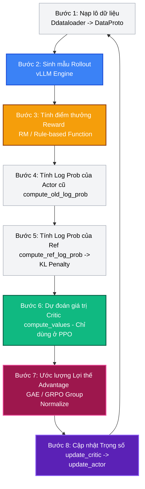

# Bài 4: Khảo sát Mã nguồn - Chu trình huấn luyện PPO & GRPO

Để hiểu rõ cách `verl` biến các khái niệm lý thuyết thành một hệ thống phân tán chạy ổn định, chúng ta sẽ cùng lần vết (walkthrough) mã nguồn cốt lõi của thư viện. Tiêu điểm phân tích là lớp **`RayPPOTrainer`** nằm trong file `verl/trainer/ppo/ray_trainer.py`.

---

## 1. Cấu trúc thư mục cốt lõi của verl

Dưới đây là sơ đồ tổ chức mã nguồn liên quan đến chu trình huấn luyện RL của thư viện `verl`:

```
verl
 ├── trainer
 │     ├── main_ppo.py        # Điểm khởi chạy (Entrypoint) cấu hình CLI và nạp dữ liệu SFT/RL.
 │     └── ppo
 │           ├── ray_trainer.py # Bộ điều phối chính (Driver) chạy Single-Controller, quản lý loop huấn luyện.
 │           └── core_algos.py  # Hiện thực toán học: Tính KL penalty, GAE, lợi thế GRPO, surrogate loss.
 ├── protocol.py              # Định nghĩa giao thức DataProto dựa trên TensorDict để trao đổi dữ liệu.
 └── workers
       ├── fsdp_workers.py    # Wrapper đóng gói các Worker huấn luyện bằng FSDP.
       └── rollout
             └── vllm
                   └── vllm_rollout.py # Worker suy luận tích hợp vLLM làm nhân sinh mẫu.
```

---

## 2. Phân tích chi tiết chu trình huấn luyện: Phương thức `RayPPOTrainer.fit()`

Phương thức `fit()` chính là trung tâm điều phối của Driver. Lập trình viên có thể đọc đoạn mã này một cách tuần tự từ trên xuống dưới mà không cần quan tâm đến cơ chế truyền tin Ray phức tạp. Dưới đây là 8 bước đi của dữ liệu trong một bước huấn luyện (Global Step):



### Bước 1: Nạp lô dữ liệu (Batch Loading)
Driver lấy dữ liệu từ `self.train_dataloader`. Dữ liệu ban đầu là một dictionary Python thông thường được đóng gói thành đối tượng `DataProto`:
```python
batch: DataProto = DataProto.from_single_dict(batch_dict)
```
Mỗi câu hỏi (prompt) được gán một mã định danh duy nhất `uid` để phục vụ việc nhóm dữ liệu trong thuật toán GRPO.

### Bước 2: Sinh mẫu câu trả lời (Rollout Generation)
Driver gửi các prompt tới nhóm Worker sinh mẫu để tạo câu trả lời tương ứng:
```python
gen_batch_output = self.async_rollout_manager.generate_sequences(gen_batch_output)
```
Dưới lớp nền, vLLM sử dụng cơ chế song song hóa Tensor Parallelism (TP) để suy luận giải mã với tốc độ cao nhất. Sau khi sinh mẫu xong, Driver tạm thời đưa vLLM vào trạng thái ngủ qua lệnh `self.checkpoint_manager.sleep_replicas()` để giải phóng VRAM cho các pha tiếp theo.

### Bước 3: Tính điểm thưởng (Reward Computation)
Nếu sử dụng mô hình phần thưởng (Reward Model) phân tán, hệ thống sẽ gọi:
```python
batch_reward = self._compute_reward_colocate(batch)
batch = batch.union(batch_reward)
```
Sau đó, Driver trích xuất điểm thưởng thực tế thông qua hàm trợ giúp `extract_reward(batch)`.

### Bước 4: Tính Log Prob của Actor cũ (Log Prob Recomputation)
Để phục vụ việc tính toán tỷ lệ xác suất $r_t(\theta)$ trong PPO/GRPO, Driver yêu cầu nhóm Actor Worker tính toán phân phối xác suất của các token vừa sinh ra dựa trên trọng số Actor hiện tại:
```python
old_log_prob, old_log_prob_mfu = self._compute_old_log_prob(batch)
batch = batch.union(old_log_prob)
```

### Bước 5: Tính Log Prob của Reference & Áp dụng phạt KL (KL Penalty)
Driver tính xác suất của mô hình Reference và áp dụng hình phạt KL divergence để hướng Actor không đi lệch quá xa khỏi hành vi ban đầu:
```python
ref_log_prob = self._compute_ref_log_prob(batch)
batch = batch.union(ref_log_prob)
batch, kl_metrics = apply_kl_penalty(batch, kl_ctrl=self.kl_ctrl_in_reward, ...)
```

### Bước 6: Dự đoán giá trị Critic (Chỉ áp dụng với PPO)
Nếu cấu hình sử dụng PPO (yêu cầu mạng Critic), Driver sẽ gọi mạng Critic dự đoán giá trị cơ sở cho các token:
```python
values = self._compute_values(batch)
batch = batch.union(values)
```

### Bước 7: Ước lượng Lợi thế (Advantage Estimation)
Đây là một bước tính toán nhẹ về mặt tài nguyên (chỉ gồm các phép toán cộng trừ nhân chia tensor cơ bản). Do đó, **verl lựa chọn thực hiện tính toán này trực tiếp trên tiến trình Driver (CPU/GPU đầu tiên)** nhằm tránh chi phí RPC mạng:
```python
batch = compute_advantage(
    batch,
    adv_estimator=self.config.algorithm.adv_estimator,
    gamma=self.config.algorithm.gamma,
    lam=self.config.algorithm.lam,
    ...
)
```

#### So sánh mã nguồn tính Advantage trong `core_algos.py`:
* **Với PPO (GAE)**: Tính toán dựa trên độ chênh lệch giữa điểm thưởng thực tế và giá trị dự đoán của Critic:
  ```python
  # GAE logic in core_algos.py
  delta = rewards + gamma * values[:, 1:] - values[:, :-1]
  advantages = compute_discounted_cumulative_sum(delta, gamma * lam)
  ```
* **Với GRPO**: Gom nhóm các câu trả lời dựa trên `uid` của prompt, sau đó tính trung bình và độ lệch chuẩn để chuẩn hóa điểm số ngay trong nhóm:
  ```python
  # GRPO logic in core_algos.py
  # Gom nhóm và chuẩn hóa điểm thưởng tương đối trong nhóm
  advantages = (rewards - group_mean) / (group_std + 1e-8)
  ```

### Bước 8: Cập nhật Trọng số (Update)
Driver phát lệnh cập nhật trọng số tới các Worker huấn luyện (chạy song song FSDP). Các Worker này chạy lan truyền ngược, tính toán gradient và cập nhật trọng số qua các bộ tối ưu hóa Adam:
```python
critic_output = self._update_critic(batch)
actor_output = self._update_actor(batch)
```
Sau khi hoàn thành cập nhật, 3D-HybridEngine lại thực hiện đồng bộ hóa trọng số Actor mới sang vLLM/SGLang để chuẩn bị cho chu trình tiếp theo.

---

## 💡 Nhận xét cốt lõi về Thiết kế mã nguồn

Mã nguồn của `verl` thể hiện sự thực thi xuất sắc của triết lý **HybridFlow**:
1. Lập trình viên không cần viết mã điều phối mạng thủ công (như gửi/nhận MPI hay thiết lập socket). Các lệnh gọi RPC được che giấu hoàn toàn dưới dạng các phương thức gọi hàm tự nhiên như `self._update_actor(batch)`.
2. Việc phân chia tải và thu thập kết quả (`dispatch` và `collect`) của đối tượng `DataProto` diễn ra tự động nhờ decorator `@register`.
3. Nhờ thực hiện tính toán Advantage trực tiếp trên Driver, `verl` tiết kiệm được một lượng lớn giao tiếp RPC dư thừa giữa các node GPU.
