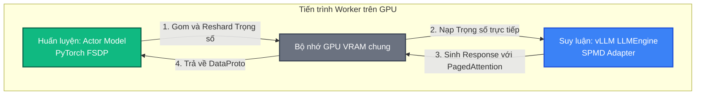
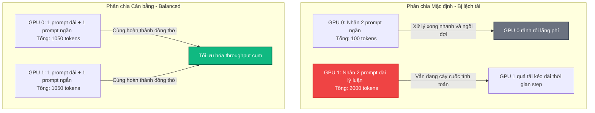

# Bài 5: Tích hợp và Tối ưu hóa Inference Engine (vLLM & SGLang)

Trong pha sinh mẫu (Rollout), tốc độ và hiệu suất giải mã đóng vai trò quyết định đến 60-80% thời gian chạy của cả pipeline RLHF. Thay vì tự viết hàm sinh mẫu bằng PyTorch thô sơ (vốn rất chậm và tốn bộ nhớ), `verl` tích hợp trực tiếp các công nghệ suy luận mạnh mẽ nhất hiện nay là **vLLM** và **SGLang**.

Bài viết này phân tích sâu cơ chế tích hợp này cùng hai kỹ thuật tối ưu hóa cốt lõi: **Sequence Packing** và **Sequence Length Balancing**.

---

## 1. Cơ chế tích hợp vLLM dưới dạng Worker

Trong cấu trúc của `verl`, vLLM không chạy độc lập như một API Server ngoài. Thay vào đó, nó được khởi tạo trực tiếp trong cùng một không gian tiến trình với các Worker huấn luyện (Colocated Workers) thông qua lớp **`vLLMRollout`** (nằm trong file `verl/workers/rollout/vllm/vllm_rollout.py`).



### Cách thức hoạt động:
* **Khởi tạo SPMD**: vLLM được chạy dưới dạng các thực thể `LLMEngine` phân tán (SPMD - Single Program Multiple Data) trên cùng số lượng GPU với Actor.
* **Đồng bộ trọng số**: Mỗi khi bước sang pha Rollout, `FSDPVLLMShardingManager` sẽ thu thập các tham số của FSDP trên GPU, định hình lại (reshard) và sao chép trực tiếp vào các biến tensor trọng số của vLLM trong VRAM. Quá trình này không đi qua CPU nên tốc độ cực nhanh.
* **Thực thi sinh mẫu**: vLLM nhận các token đầu vào, kích hoạt cơ chế PagedAttention để quản lý KV Cache hiệu quả và thực hiện suy luận song song Tensor Parallelism (TP) trên các rank GPU.

---

## 2. Kỹ thuật Sequence Packing (Đóng gói chuỗi)

Trong suy luận LLM truyền thống, các câu trả lời có độ dài khác nhau trong cùng một lô (Batch) bắt buộc phải đệm thêm các token `<pad>` về phía bên trái hoặc phải để đưa về dạng ma trận 2D hình chữ nhật có kích thước cố định.

```
Mô hình đệm Padding truyền thống (Lãng phí tài nguyên):
[ Token 1 ] [ Token 2 ] [ Token 3 ] [ <pad>   ] [ <pad>   ]
[ Token 1 ] [ Token 2 ] [ Token 3 ] [ Token 4 ] [ Token 5 ]
```

Việc này gây lãng phí bộ nhớ và năng lực tính toán cực lớn, bởi vì độ phức tạp của cơ chế Attention tăng theo hàm mũ bình phương $O(L^2)$ của chiều dài chuỗi. GPU vẫn phải tính toán cơ chế Attention trên cả các token `<pad>` vô nghĩa.

### Giải pháp Sequence Packing của verl:
`verl` loại bỏ hoàn toàn các token `<pad>` bằng cách ép toàn bộ các chuỗi trong batch thành một mảng 1D liên tục duy nhất.

```
Mô hình Sequence Packing (Không có pad):
[ T1_1 ] [ T1_2 ] [ T1_3 ] [ T2_1 ] [ T2_2 ] [ T2_3 ] [ T2_4 ] [ T2_5 ]
```

Để các lõi tính toán Attention (như FlashAttention-2 hoặc FlashInfer) biết điểm bắt đầu và kết thúc của từng chuỗi khác nhau, `verl` truyền thêm một mảng bổ trợ chỉ số tích lũy độ dài chuỗi (`cu_seqlens` - cumulative sequence lengths) và mảng chỉ số vị trí logic (`position_ids`). Cơ chế này giúp loại bỏ 100% chi phí tính toán thừa trên các token đệm, nâng cao throughput giải mã lên nhiều lần.

---

## 3. Giải thuật Cân bằng tải Chiều dài Chuỗi (Sequence Length Balancing)

Trong pha Rollout của RLHF, do đặc tính sinh mẫu ngẫu nhiên (sampling) hoặc khả năng tự suy luận sâu của mô hình (ví dụ: các mô hình R1 suy nghĩ rất dài), độ dài của các câu trả lời sinh ra cho các prompt khác nhau sẽ biến thiên cực kỳ lớn. Có câu trả lời chỉ dài 50 tokens, nhưng có câu trả lời toán học/lý luận dài tới 2000 tokens.

Nếu phân chia dữ liệu theo cách mặc định (chia đều số lượng request cho các GPU), ta sẽ gặp phải hiệu ứng **Straggler Effect (Nghẽn cổ chai nút thắt)**:



### Cách verl giải quyết bằng Cân bằng tải (Sequence Length Balancing):
Nằm trong file `verl/utils/seqlen_balancing.py`, `verl` triển khai thuật toán cân bằng tải trước mỗi pha tối ưu:

1. **Ước lượng khối lượng công việc (Workload Estimation)**: 
   Với mỗi sequence $i$ trong batch, hệ thống tính toán ước lượng tổng số lượng token:
   $$W_i = L_{\text{prompt}, i} + L_{\text{response}, i}$$
2. **Phân vùng tham lam (Greedy Partitioning)**: 
   Sử dụng giải thuật LPT (Longest Processing Time first):
   * Sắp xếp danh sách các sequence theo thứ tự khối lượng công việc $W_i$ giảm dần.
   * Lần lượt duyệt qua từng chuỗi và gán nó vào GPU Rank đang có tổng khối lượng công việc hiện tại nhỏ nhất.
3. **Phân phối lại dữ liệu**:
   Sau khi phân nhóm cân bằng, dữ liệu được gửi đến các GPU Worker tương ứng. Việc này đảm bảo các GPU hoàn thành pha tính toán lan truyền ngược gần như đồng thời, loại bỏ thời gian chết (idle time), tối đa hóa throughput của toàn bộ cụm.

---

## 💡 Tóm tắt Bài học

Việc kết nối sâu với vLLM/SGLang cùng việc áp dụng các kỹ thuật tối ưu hóa bộ đệm giúp `verl` đạt hiệu năng suy luận vượt trội so với các framework RLHF đời đầu:
1. **vLLM Rollout Worker** loại bỏ chi phí truyền thông trọng số qua host memory bằng cơ chế weight resharding GPU-to-GPU trực tiếp.
2. **Sequence Packing** giúp loại bỏ 100% các token đệm `<pad>`, giảm độ phức tạp tính toán Attention xuống tối thiểu.
3. **Sequence Length Balancing** loại bỏ hiện tượng lệch tải GPU do độ dài câu trả lời lý luận biến động mạnh.
