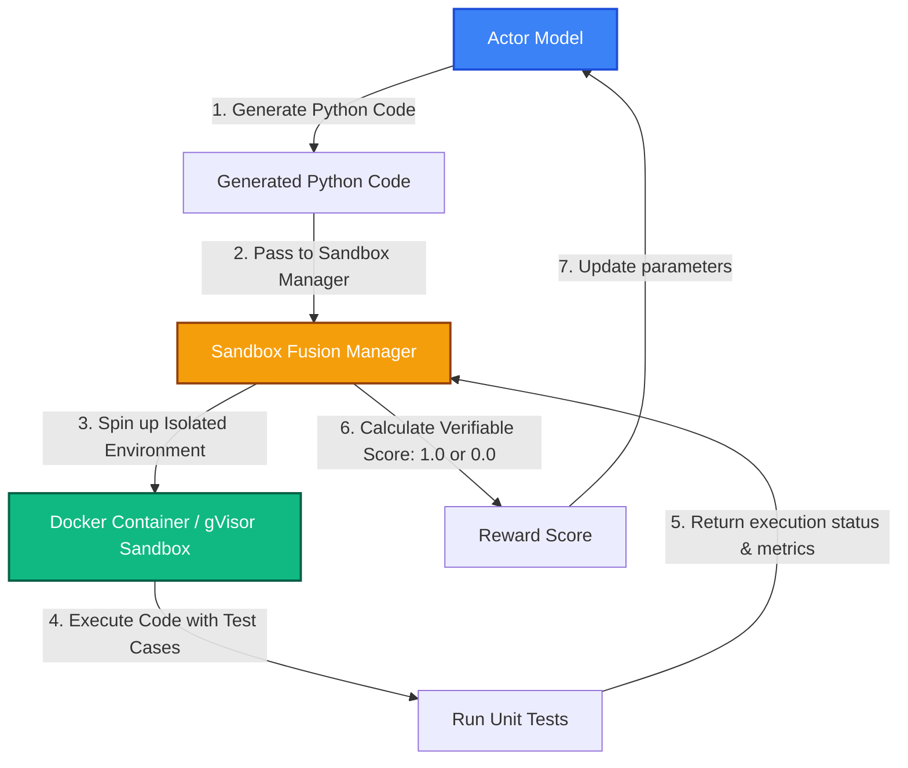

# Bài 6: Quản lý Phần thưởng Khả thi & Tương tác Công cụ (Rule-based & Sandbox)

Trong huấn luyện RLHF truyền thống cho các tác vụ văn học hoặc hội thoại, người ta thường dùng một mô hình phần thưởng (Reward Model - RM) dạng mạng neural để chấm điểm. Tuy nhiên, mô hình RM rất dễ bị Actor "đánh lừa" (Reward Hacking) – Actor tự tìm ra các cụm từ hoa mỹ hoặc khuôn mẫu làm vừa lòng RM mà không thực sự trả lời đúng câu hỏi.

Đối với các mô hình lý luận (Reasoning Models) như DeepSeek-R1 hay OpenAI o1, các tác giả ưu tiên sử dụng **Phần thưởng khả thi dựa trên quy tắc (Rule-based / Verifiable Rewards)** và tích hợp **môi trường thực thi độc lập (Sandbox Fusion)**.

Bài viết này phân tích sâu cách `verl` hiện thực hóa cơ chế quản lý phần thưởng chính xác này.

---

## 1. Phần thưởng Khả thi (Verifiable Rewards) là gì?

Phần thưởng khả thi là các tiêu chí đánh giá đúng/sai mang tính chất tuyệt đối và không thể bị gian lận.

* **Trong Toán học**: Kiểm tra xem đáp án cuối cùng của mô hình có trùng khớp với đáp án chính xác (Ground Truth) hay không.
* **Trong Lập trình**: Biên dịch mã nguồn do mô hình sinh ra và chạy thử với các ca kiểm thử (Unit Tests) có sẵn.

### Cách verl hiện thực hàm thưởng toán học (`math.py`):
Nằm trong thư mục `verl/utils/reward_score/math.py`, `verl` triển khai các hàm trích xuất kết quả tự động:

1. **Trích xuất đáp án**: Sử dụng Regex để tìm kết quả nằm trong hộp Latex chuẩn: `\boxed{result}` hoặc tìm số/biểu thức cuối cùng trong văn bản.
2. **Đồng nhất định dạng toán học**: Sử dụng thư viện ký hiệu toán học (như `sympy`) để rút gọn các biểu thức hoặc phân số, đảm bảo rằng $\frac{1}{2}$ được coi là bằng $0.5$ hay $x+y$ bằng $y+x$.
3. **So sánh và chấm điểm**: So sánh trực tiếp với Ground Truth. Điểm thưởng trả về là điểm nhị phân tuyệt đối: $1.0$ (nếu đúng) và $0.0$ (nếu sai).

---

## 2. Công thức thưởng định dạng DeepSeek R1-style

Để huấn luyện LLM tự sinh ra chuỗi suy nghĩ dài (Chain of Thought - CoT) trước khi trả lời, DeepSeek-R1 áp dụng đồng thời hai loại quy tắc thưởng:

1. **Thưởng nội dung (Accuracy Reward)**: Đạt $1.0$ điểm nếu kết quả cuối cùng chính xác.
2. **Thưởng định dạng (Format Reward)**: Ràng buộc mô hình phải viết chuỗi tư duy của mình vào giữa thẻ `<think>...</think>` và câu trả lời cuối cùng vào sau `<answer>...</answer>` hoặc thẻ tương đương. Nếu viết sai cấu trúc hoặc thiếu thẻ, mô hình sẽ bị trừ điểm thưởng (ví dụ: chỉ nhận tối đa $0.1$ điểm).

```
Mẫu câu trả lời tiêu chuẩn:
<think>
Ta có phương trình x + 5 = 12.
Trừ cả hai vế cho 5: x = 12 - 5 = 7.
</think>
<answer>7</answer>
```

Cơ chế này khuyến khích mô hình liên tục mở rộng chuỗi suy nghĩ (CoT) để tìm ra đáp án đúng nhất mà không cần con người viết sẵn các bước suy nghĩ mẫu.

---

## 3. Tích hợp môi trường chạy mã an toàn: Sandbox Fusion

Đối với các tác vụ lập trình (huấn luyện Actor trên tập dữ liệu HumanEval, MBPP, Codeforces), việc chạy thử mã nguồn do mô hình tự viết trên chính hệ điều hành máy chủ là cực kỳ nguy hiểm (Actor có thể vô tình hoặc cố ý viết mã xóa file, chiếm quyền root hoặc phá hủy tài nguyên hệ thống).

`verl` giải quyết bài toán này thông qua **Sandbox Fusion** (Môi trường thực thi mã cô lập).



### Cơ chế Sandbox Fusion:
* **Tách biệt ảo hóa**: Sandbox Manager sẽ khởi tạo nhanh một container Docker siêu nhẹ hoặc môi trường Sandbox (như gVisor) cho mỗi yêu cầu chạy mã.
* **Giới hạn tài nguyên**: Container bị giới hạn nghiêm ngặt về thời gian chạy (Timeout $\sim 5$ giây), dung lượng RAM (ví dụ: tối đa 512MB) và hoàn toàn bị ngắt kết nối Internet để tránh các cuộc tấn công mạng.
* **Đánh giá mã**: Mã của Actor được chạy thử với các Testcases đầu vào/đầu ra. Kết quả biên dịch (thành công/lỗi cú pháp) và số lượng testcases vượt qua được trả về làm căn cứ tính điểm thưởng.

---

## 4. Huấn luyện RL đa lượt với Gọi Công cụ (Multi-turn Tool RL)

Trong các tác vụ nâng cao (như Agent tìm kiếm thông tin, giải toán bằng máy tính bỏ túi), Actor cần thực hiện nhiều lượt tương tác (Multi-turn) với các công cụ bên ngoài:

```
Lượt 1: Actor sinh lệnh gọi công cụ: [CALL: Search "dân số Việt Nam 2026"]
Lượt 1 (Môi trường): Trả về kết quả: "Dự kiến khoảng 102 triệu người"
Lượt 2: Actor đọc thông tin và sinh câu trả lời cuối cùng.
```

`verl` hỗ trợ huấn luyện RL đa lượt bằng cách tích hợp sâu với **SGLang**:
* **Tối ưu hóa KV Cache đa lượt**: Khi Actor gọi công cụ và nhận về phản hồi, `verl` và SGLang phối hợp để đóng băng và tái sử dụng KV Cache của các lượt trước đó (Prompt History), chỉ tính toán Attention cho các token phản hồi mới. Việc này giúp giảm chi phí tính toán đa lượt từ mức $O(L^2)$ xuống tuyến tính, mở đường cho việc huấn luyện các Agent thông minh trên quy mô lớn.

---

## 💡 Kết luận

Phần thưởng khả thi và cơ chế Sandbox Fusion là chìa khóa để vượt qua giới hạn của học máy truyền thống:
1. **Loại bỏ hoàn toàn Reward Hacking**: Actor bắt buộc phải giải bài toán chính xác mới nhận được điểm thưởng, thay vì chỉ tìm cách viết văn làm hài lòng mô hình Reward.
2. **Hỗ trợ Huấn luyện Tự do (Self-Play)**: Giống như AlphaGo, mô hình có thể tự đấu với chính mình và nâng cao năng lực thông qua việc vượt qua các Unit tests ngày càng khó trong Sandbox.
3. **Mở rộng sang hướng Agent**: Tích hợp gọi công cụ đa lượt giúp LLM học cách tương tác thực tế với thế giới phần mềm một cách tối ưu.
