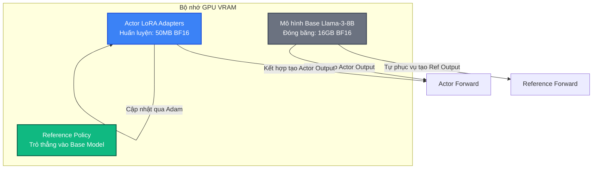

# Bài 7: Hướng dẫn Tối ưu Hiệu năng & Mở rộng Quy mô lớn

Huấn luyện các mô hình ngôn ngữ lớn bằng học tăng cường (RLHF) là một tác vụ tiêu tốn cực kỳ nhiều tài nguyên tính toán. Để vận hành hệ thống ổn định trên hàng chục hoặc hàng trăm GPU mà không bị lỗi tràn bộ nhớ (OOM) hay nghẽn mạng, chúng ta cần nắm vững các kỹ thuật tối ưu hóa hiệu năng chuyên sâu của `verl`.

---

## 1. Sử dụng FSDP2 và cơ chế CPU Offloading

Trong các phiên bản PyTorch hiện đại, **FSDP2 (Fully Sharded Data Parallel 2)** được khuyên dùng để thay thế cho FSDP thế hệ đầu nhờ khả năng tương thích tốt với tính năng biên dịch mô hình `torch.compile` và cơ chế quản lý bộ nhớ thông minh hơn.

Để tiết kiệm VRAM tối đa, chúng ta có thể bật tính năng **CPU Offloading** cho Actor Model. Khi tính năng này hoạt động:

* Toàn bộ trạng thái tối ưu hóa (Optimizer States - thành phần ngốn nhiều RAM nhất của bộ tối ưu Adam) và Gradients sẽ được chuyển dịch sang bộ nhớ RAM của hệ thống (CPU Host Memory) thay vì chiếm dụng bộ nhớ VRAM của GPU.
* Quá trình tính toán lan truyền xuôi và ngược vẫn diễn ra trên GPU, nhưng trọng số và optimizer states sẽ được nạp/xả động giữa CPU và GPU theo từng bước mini-batch.

### Cấu hình FSDP2 trong verl (`yaml`):
```yaml
actor_rollout_ref:
  actor:
    strategy: fsdp2
    fsdp_config:
      offload_policy: True # Bật CPU Offloading cho Actor
  ref:
    strategy: fsdp2
critic:
  strategy: fsdp2
```
*Việc bật CPU Offloading kết hợp tích lũy gradient (gradient accumulation) cho phép chúng ta huấn luyện mô hình 7B trên một chiếc GPU 80GB đơn lẻ mà không bị OOM.*

---

## 2. Huấn luyện RL hiệu quả bộ nhớ bằng LoRA (LoRA RL)

Phương pháp huấn luyện toàn bộ tham số (Full Parameter Fine-Tuning) đòi hỏi chúng ta phải duy trì các trạng thái Gradients và Adam Optimizer khổng lồ cho cả mô hình Actor 7B/70B.

**LoRA (Low-Rank Adaptation)** giải quyết bài toán này bằng cách đóng băng toàn bộ mô hình gốc và chỉ chèn thêm các cặp ma trận rank nhỏ (adapter) vào các lớp Attention để huấn luyện.



### Tối ưu hóa Colocation đặc biệt trong verl nhờ LoRA:
Nếu sử dụng LoRA, `verl` áp dụng một cấu hình vô cùng thông minh: **`ref_in_actor = True`**.
* **Bản chất**: Mô hình Reference chính là mô hình Actor lúc chưa áp dụng LoRA.
* **Tối ưu**: Thay vì khởi tạo mô hình Reference dưới dạng một thực thể độc lập chiếm thêm 16GB VRAM, `verl` chỉ tải duy nhất một mô hình Base dùng chung. Khi cần tính toán Reference Log Prob, hệ thống tạm thời vô hiệu hóa LoRA Adapter trên mô hình Actor hiện tại.
* **Kết quả**: Tiết kiệm ngay lập tức gần **16GB VRAM** đối với mô hình 7B, giảm thiểu tối đa tài nguyên phần cứng.

---

## 3. Mở rộng quy mô với Expert Parallelism (EP) cho mô hình MoE

Đối với các mô hình Mixture of Experts (MoE) khổng lồ như DeepSeek-V3 hay DeepSeek-R1 (có tổng số 671 tỷ tham số, trong đó 37 tỷ tham số kích hoạt cho mỗi token), các kỹ thuật song song dữ liệu thông thường hoàn toàn bất khả thi.

`verl` hỗ trợ mở rộng quy mô thông qua **Expert Parallelism (Song song hóa chuyên gia - EP)**:
* Trọng số của các Chuyên gia (Experts) khác nhau trong lớp MoE được phân bố rải rác trên các GPU khác nhau trong cụm.
* Kết hợp với **DeepSpeed Ulysses (Sequence Parallelism)**: Chia nhỏ chuỗi token đầu vào theo chiều dài (sequence length) rồi gửi đến các GPU. Các token sau đó được định tuyến (routed) qua mạng NCCL All-to-All để tìm đến đúng GPU chứa Chuyên gia mà nó cần tính toán.
* Việc này giúp huấn luyện thành công các mô hình MoE siêu lớn trên hàng trăm GPU với băng thông giao tiếp tối ưu.

---

## 4. Cẩm nang sửa lỗi hệ thống (Troubleshooting Guide)

### 🚨 Lỗi 1: Tràn bộ nhớ VRAM (Out of Memory - OOM) trong pha Rollout
* **Triệu chứng**: GPU bị tràn bộ nhớ ngay khi bắt đầu bước sinh mẫu (Rollout).
* **Nguyên nhân**: vLLM cấp phát bộ đệm KV Cache quá lớn hoặc kích thước batch sinh mẫu vượt quá năng lực chứa của GPU.
* **Cách xử lý**:
  1. Giảm kích thước batch phát sinh mẫu `data.gen_batch_size`.
  2. Điều chỉnh tham số bộ nhớ vLLM trong file cấu hình: giảm tỷ lệ chiếm dụng VRAM tối đa của vLLM (`vllm_gpu_memory_utilization = 0.4` hoặc thấp hơn) để chừa khoảng trống cho Actor/Critic.
  3. Giảm độ dài tối đa của token sinh ra `actor_rollout_ref.rollout.space_max_token_len`.

### 🚨 Lỗi 2: Tràn bộ nhớ VRAM (OOM) trong pha Update (Huấn luyện)
* **Triệu chứng**: Giải mã thành công nhưng crash OOM ngay khi bắt đầu cập nhật trọng số.
* **Nguyên nhân**: Kích thước mini-batch huấn luyện quá lớn hoặc không giải phóng bộ nhớ đệm KV Cache của vLLM trước khi train.
* **Cách xử lý**:
  1. Giảm kích thước mini-batch huấn luyện của Actor/Critic: `actor.mini_batch_size` và `critic.mini_batch_size`.
  2. Tăng số bước tích lũy gradient `actor.gradient_accumulation_steps` để bù lại kích thước batch lớn.
  3. Kiểm tra xem đã bật CPU Offloading (`offload_policy=True`) chưa.

### 🚨 Lỗi 3: Lỗi nghẽn luồng Ray Worker (Worker Hang / Timeout)
* **Triệu chứng**: Quá trình huấn luyện bị đứng im vô thời hạn ở một bước cụ thể, tiến trình không báo lỗi nhưng không chạy tiếp.
* **Nguyên nhân**: Lệch tải nghiêm trọng giữa các GPU (một GPU nhận chuỗi quá dài chưa xử lý xong, các GPU khác đã xong và đang đợi) hoặc mất kết nối Ray node.
* **Cách xử lý**:
  1. Đảm bảo cấu hình cân bằng tải đã được bật: `trainer.balance_batch=True`.
  2. Tăng thời gian chờ đăng ký của Ray: thiết lập `trainer.ray_wait_register_center_timeout = 300` (giây).
  3. Kiểm tra băng thông mạng giữa các node GPU bằng các công cụ đo đạc kiểm thử NCCL (NCCL Tests).
