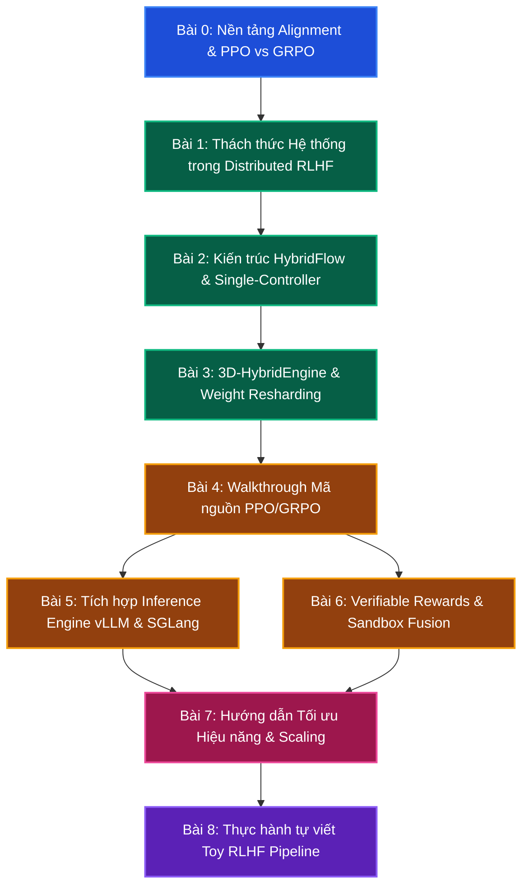

# Lộ trình học tập & Phân tích cấu trúc thư viện verl

Chào mừng bạn đến với tài liệu phân tích chuyên sâu về kiến trúc và hiện thực của thư viện **verl** (Volcano Engine Reinforcement Learning for LLMs) do ByteDance Seed team phát triển và mã nguồn mở hóa. 

Học tăng cường từ phản hồi phản hồi (RLHF) là một trong những thành phần cốt lõi để xây dựng các mô hình ngôn ngữ lớn có khả năng tư duy và lập luận mạnh mẽ (như loạt mô hình DeepSeek-R1, OpenAI o1/o3). Tuy nhiên, việc huấn luyện RLHF trên quy mô lớn gặp phải những thách thức hệ thống cực kỳ phức tạp. Thư viện `verl` ra đời nhằm giải quyết triệt để bài toán này bằng cách tách biệt luồng lập trình RL (Control Flow) và luồng xử lý tính toán phân tán (Computation Flow).

Dưới đây là giáo trình tự học gồm 9 bài học đi từ lý thuyết nền tảng đến chi tiết hiện thực và tối ưu hiệu năng của `verl`.

---

---

## Tóm tắt Giáo trình 9 Bài học

### 📌 Phần 1: Kiến thức nền tảng & Thách thức Hệ thống (Background)
* **[Bài 0: Nền tảng Alignment & Thuật toán PPO vs GRPO](lesson_0_alignment_fundamentals)**
  * Tại sao LLM cần Alignment? So sánh SFT, DPO và Học tăng cường (RL).
  * Chi tiết toán học của PPO (Proximal Policy Optimization).
  * Chi tiết toán học của GRPO (Group Relative Policy Optimization) - xương sống của các mô hình lý luận (Reasoning Models) như DeepSeek-R1.
  * Vai trò của 4 thực thể mô hình trong RLHF: Actor, Reference, Critic và Reward.
* **[Bài 1: Thách thức Kỹ thuật Hệ thống trong Distributed RLHF](lesson_1_distributed_rl_challenges)**
  * Phân tích chu kỳ Rollout-Training phức tạp và sự dịch chuyển trạng thái liên tục giữa suy luận và huấn luyện.
  * Thách thức bộ nhớ (Memory Bottleneck) khi tải đồng thời 4 mô hình lớn lên GPU.
  * Các loại song song hóa cần thiết (TP, PP, DP, FSDP) và tại sao các framework truyền thống như Megatron hay FSDP đơn lẻ không tối ưu được toàn bộ pipeline RLHF.

### 📌 Phần 2: Kiến trúc cốt lõi của verl (Core Theory)
* **[Bài 2: Mô hình Lập trình HybridFlow & Cơ chế Single-Controller](lesson_2_hybridflow_programming_model)**
  * Triết lý thiết kế HybridFlow: Tách biệt Control Flow (Single Process) chạy trên driver và Computation Flow (Multi-process) chạy trên GPU Workers.
  * Phân tích các cấu trúc `WorkerGroup`, `ResourcePool`, `ClassWithArgs`.
  * Cách đóng gói và trao đổi dữ liệu phi trạng thái thông qua giao thức `DataProto` (dựa trên `TensorDict`).
* **[Bài 3: 3D-HybridEngine & Cơ chế Tự động Resharding Trọng số](lesson_3_hybrid_engine_resharding)**
  * Tại sao Generation cần Tensor Parallelism (TP) trong khi Training cần ZeRO/FSDP hoặc Pipeline Parallelism (PP).
  * Cơ chế tự động chuyển đổi phân mảnh trọng số mô hình (Weight Resharding) cực nhanh giữa pha Generation và Training của 3D-HybridEngine.
  * Tối ưu hóa truyền dẫn dữ liệu và phân phối bộ nhớ qua NCCL.

### 📌 Phần 3: Phân tích sâu mã nguồn & Tích hợp (Deep Dive & Integration)
* **[Bài 4: Khảo sát Mã nguồn - Chu trình huấn luyện PPO & GRPO](lesson_4_source_code_walkthrough)**
  * Lần vết mã nguồn trong `main_ppo.py`, `RayPPOTrainer` (phương thức `fit`), và `core_algos.py`.
  * Chi tiết luồng thực thi: Phát sinh mẫu (rollout) -> recompute log prob -> kl penalty -> advantage calculation (GAE/GRPO) -> cập nhật trọng số.
* **[Bài 5: Tích hợp và Tối ưu hóa Inference Engine (vLLM & SGLang)](lesson_5_inference_engine_integration)**
  * Cách verl tích hợp vLLM và SGLang làm nhân phát sinh mẫu thông qua các lớp Worker.
  * Kỹ thuật tối ưu hóa sequence packing và Sequence Length Balancing nhằm cân bằng tải GPU.
* **[Bài 6: Quản lý Phần thưởng Khả thi & Tương tác Công cụ (Rule-based & Sandbox)](lesson_6_verifiable_rewards_tool_use)**
  * Viết hàm thưởng dựa trên quy tắc (Rule-based / Verifiable Rewards) cho toán học và lập trình (DeepSeek-R1 style).
  * Tích hợp môi trường chạy mã độc lập (Sandbox Fusion).
  * Hỗ trợ huấn luyện RL đa lượt (Multi-turn RL) và tích hợp các công cụ bên ngoài (Tool-calling).

### 📌 Phần 4: Tối ưu nâng cao & Thực hành (Optimization & Practice)
* **[Bài 7: Hướng dẫn Tối ưu Hiệu năng & Mở rộng Quy mô lớn](lesson_7_performance_tuning_scaling)**
  * Tối ưu hóa bộ nhớ qua FSDP2 CPU Offloading và Gradient Accumulation.
  * Huấn luyện RL hiệu quả bằng LoRA (LoRA RL).
  * Phục vụ các mô hình MoE khổng lồ (như DeepSeek-671B) thông qua Expert Parallelism.
  * Debug các lỗi OOM và nghẽn Ray/NCCL.
* **[Bài 8: Thực hành - Tự viết Toy RLHF Pipeline với Single-Controller](lesson_8_toy_rlhf_pipeline)**
  * Thực hành lập trình từ đầu một pipeline huấn luyện RLHF tối giản bằng Python sử dụng Threading/Multiprocessing mô phỏng Ray WorkerGroup và DataProto.
  * Thực thi một chu trình GRPO/PPO trên dữ liệu giả định để làm chủ lý thuyết.
