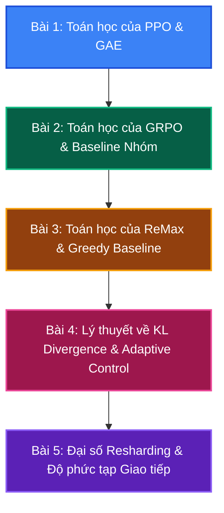

# Lộ trình Lý thuyết & Toán học của verl

Chào mừng bạn đến với chương **Đào sâu Lý thuyết, Toán học và Mã giả (Math & Theory Deep Dive)**.

Để làm chủ hoàn toàn các hệ thống căn chỉnh LLM phân tán, chúng ta phải vượt qua lớp vỏ bọc giao diện và mã nguồn để đi vào gốc rễ lý thuyết toán học của các thuật toán. Phần này sẽ cung cấp các chứng minh toán học đầy đủ, phân tích cơ chế giảm phương sai, thuật toán thích ứng và mã giả đi kèm tham chiếu mã nguồn của `verl`.

---

---

## Nội dung các bài giảng Toán học chuyên sâu

1. **[Bài 1: Toán học của PPO (GAE, Clipped Objective & Value Estimator)](theory_1_ppo_math)**
   * Bản chất toán học của Clipped Surrogate Loss, cơ chế giảm phương sai của GAE và mã giả.
2. **[Bài 2: Toán học của GRPO (Ước lượng Baseline Nhóm & Giảm phương sai)](theory_2_grpo_math)**
   * Chứng minh toán học ước lượng không chệch (unbiased) của GRPO và cơ chế loại bỏ Critic.
3. **[Bài 3: Toán học của ReMax (Greedy Baseline RLHF)](theory_3_remax_math)**
   * Cơ sở toán học của việc sử dụng Greedy Rollout làm baseline giảm phương sai.
4. **[Bài 4: Cơ sở toán học của KL Divergence & Bộ điều phối Adaptive KL](theory_4_kl_divergence)**
   * Định nghĩa thông tin của KL Penalty, Trust Region bounds, và giải thuật cập nhật $\beta$ động.
5. **[Bài 5: Đại số phân mảnh (Resharding Algebra) & Độ phức tạp Giao tiếp](theory_5_resharding_algebra)**
   * Đại số ma trận chuyển đổi FSDP sang TP và độ phức tạp truyền thông NCCL/All-to-All.
